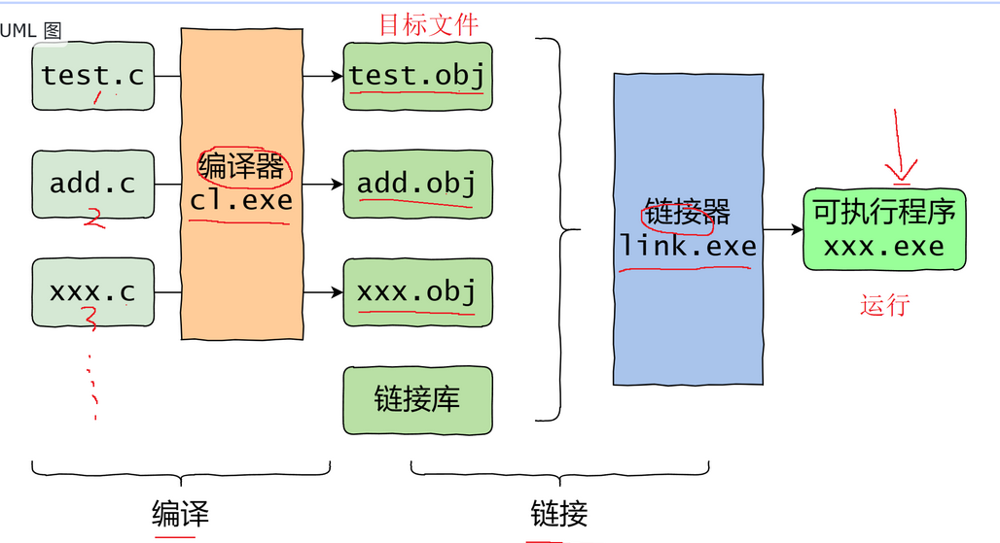
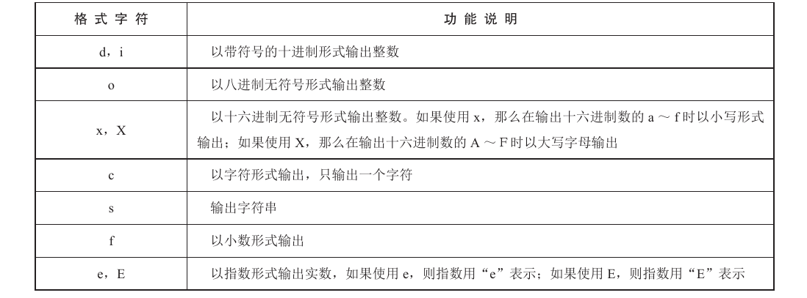
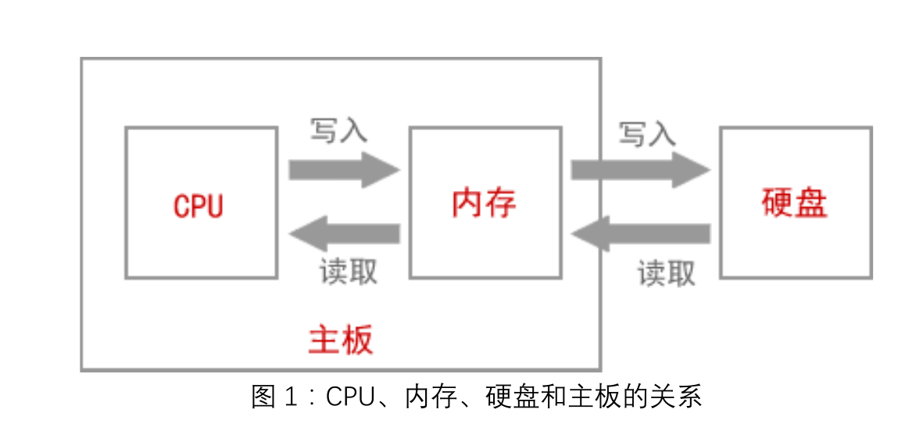

# 基础知识

## C 语言简介

- C语言广泛用于底层开发

- 计算机执行程序有两种方式：编译和解释

  - **编译**：将高级语言代码翻译成低级语言代码（如汇编或机器语言）。
  - **解释**：逐行翻译和执行源代码，解释器读取一行代码，翻译成中间代码或机器码，然后立即执行。

  区别：
  - **过程**：编译将源程序翻译成可执行的目标代码，翻译与执行分开；解释将源程序逐行翻译并执行，不生成可存储的目标代码。
  - **结果**：编译生成并存储目标代码，后续执行可复用；解释逐条执行源程序指令，不生成或存储目标代码，后续执行无法复用信息。

### 面向过程和面向对象的区别

- **面向过程**：以过程（函数）为中心，程序通过调用一系列步骤（函数）来解决问题。强调算法和过程的顺序。

- **面向对象**：以对象为中心，通过定义类和对象来组织代码。每个对象包含数据（属性）和操作数据的方法（函数）。强调数据和操作的封装、继承和多态。

**建议阅读：**

  [如何通俗易懂地举例说明「面向对象」和「面向过程」有什么区别？](https://www.zhihu.com/question/27468564)

  [面向过程 VS 面向对象](https://zhuanlan.zhihu.com/p/28427324)  

### 历史

1. **起源**：C 语言由丹尼斯·里奇（Dennis Ritchie）在 1972 年于贝尔实验室（Bell Labs）开发。它是基于 B 语言的改进，而 B 语言本身是基于 BCPL 语言。

2. **目的**：C 语言最初是为了开发 Unix 操作系统而设计的，以提供一种高效且便于移植的编程工具。

3. **标准化**：1983 年，美国国家标准学会（ANSI）成立了一个委员会来标准化 C 语言，最终在 1989 年发布了 ANSI C 标准，也称为 C89。随后，国际标准化组织（ISO）也采纳了该标准，称为 C90。

4. **后续发展**：C 语言不断演进，主要版本包括 C99（1999 年）、C11（2011 年）和 C18（2018 年），每个版本都对语言进行了扩展和改进。

### C 语言的特点

- **低级语言**：能够直接**操作硬件、管理内存，与操作系统对话**，适合编写高性能程序。

- **可移植性**：设计初衷是将 Unix 系统移植到其他架构，具有高度可移植性，程序可在多种硬件和操作系统上运行。

- **简单性**：语法简单，规则少，基本没有语法糖，提供最基本的语法，不包括高级数据结构，程序员需自行构建复杂数据结构。

- **灵活性**：对程序员限制少，允许进行各种操作，不提供内存自动清理、类型检查等保护措施，要求程序员自己管理内存和处理错误

### C 语言的编译和链接

C 语言是一种编译型语言，源代码是文本文件，无法直接执行。必须通过编译器**编译**和链接器的**链接**，生成二进制的可执行文件，才能运行。



## 第一个 程序Hello World 

```c
#include <stdio.h> //编译预处理指令，引入头文件

int main(void) {
  printf("Hello World\n");
  return 0;  
}
```

### 编译预处理

包括：**文件包含**、**宏定义**、**条件编译**

**在程序编译之前**，C编译器的**预处理器**（preprocessor）会首先对源代码进行一些准备工作，即预处理（preprocessing）

> **指令(directive)**：预处理器执行的命令称为预处理器指令，简称指令。这些指令的结尾不需要添加分号。

```c
#include<stdio.h> //引入头文件
```

相当于把头文件`stdio.h`的所有内容引入该行

`stdio.h` 文件中包含了输入和输出函数（如 `printf()`）的定义和声明，供编译器使用。该文件名的含义为**标准输入/输出**头文件（standard input/output header）


### 标准库

程序所需的功能不一定都要自己编写，C 语言可能已经提供了。程序员只需调用这些内置功能即可。例如，`printf()` 函数就是 C 语言自带的，可以直接用于在屏幕上输出内容。

这些内置功能称为“标准库”（standard library），标准库包含哪些功能及其使用方法是规定好的，确保了代码的规范性和可移植性。

不同的功能定义在不同的“头文件”（header files）中。系统自带某个功能时，会提供相应的头文件描述该功能。比如，`printf()` 的头文件是 `stdio.h`。头文件的后缀通常为`.h`。

### main函数

```c
int main(void){
    ...
    return 0;
}
```

- 程序从 `main` 函数开始运行，直到 `main` 函数结束。
- `main` 函数也称为主函数。`main` 前的 `int` 表示函数执行结束时返回一个整数值，因此在 `main` 函数末尾写 `return 0;`。
- `main` 函数是程序的唯一入口。
- `main` 函数在工程中只能有一个。
- 即使项目中有多个 `.c` 文件，也只能有一个 `main` 函数，因为程序的入口只能有一个。
- 参数：`()` 内的信息为函数的参数。示例中的 `void` 表示该函数不接收任何参数。

> **main函数中`return`的作用**：
>
> 1. **使main函数终止**。main函数在这里结束。
>
> 2. main函数返回值是0，**表示程序正常终止**。

### printf 库函数

> `printf`函数需要引入`stdio.h`头文件

`f`:`format`格式化，表示可以定制输出文本的格式

```c
int n = 100;   //变量初始化
printf("%d\n", n);	 //printf打印十进制整数
printf("%c\n", 'q'); //printf 打印字符
printf("%lf\n", 3.14)//printf 打印双精度浮点型
```

`%d`,`%c`,`%lf`叫做占位符也称**格式控制符**,  会被后面的值替换. 它指明了以何种形式输出数据,格式控制符均以`%`开头，

`printf()` 不会在行尾自动添加换行符。为了让光标移到下一行的开头，可以在输出文本的结尾添加一个换行符 `\n`

### `scanf` 函数

#### 基本用法

`scanf` 是一个用于从标准输入（通常是键盘）读取数据的函数，其原型定义在头文件 `stdio.h` 中。当程序运行到 `scanf` 语句时，会暂停执行，等待用户输入数据并按下回车键。然后，`scanf` 会处理用户的输入，将其存入指定的变量地址中。

> **注意**: 在使用 `scanf()` 函数时，普通变量前必须加上 `&` 运算符，因为 `scanf()` 需要传递的是**变量的地址**，而非变量的值。例如，`scanf("%d", &i)` 将用户输入的值存储到变量 `i` 的地址中。然而，对于指针变量（如字符串），不需要加 `&` 运算符，因为指针本身已经是一个地址。

**空白字符处理**: `scanf` 会自动过滤空白字符（空格、制表符、换行符等），因此输入数据之间的空格或换行不会影响数据的读取。

另外，用户使用回车键，将输入分成几行，也不影响解读。

`scanf()` 处理用户输入的原理是，用户的输入先放入缓存，等到按下回车键后，按照占位符对缓存进行解读。解读用户输入时，会从上一次解读遗留的第一个字符开始，直到读完缓存，或者遇到第一个不符合条件的字符为止。

#### 地址传递

- 对于非指针变量（如整数、浮点数），需要在变量前加上 `&` 运算符。
- 对于指针变量（如字符串），不需要加 `&` 运算符。

#### scanf 的返回值

`scanf()` 的返回值是一个整数，表示**成功读取的变量个数**。如果没有读取任何项或者匹配失败，则返回 0。如果在成功读取任何数据之前发生了读取错误或者遇到文件结尾，则返回常量 EOF（值为 -1）。

```c
int r = scanf("%d %d %f", &a, &b, &f);
```

#### 常用格式说明符

- `%d`：读取整数
- `%f`：读取浮点数
- `%lf`：读取双精度浮点数
- `%c`：读取单个字符
- `%s`：读取字符串（不包括空格）

#### 注意事项

1. **空白字符处理**：
   - 除了 `%c` 以外，其他占位符（如 `%d`, `%f`, `%s`）都会自动忽略输入前的空白字符。
   - `%c` 不会忽略空白字符，总是返回当前第一个字符，无论该字符是否为空格。
   - 要强制忽略 `%c` 前的空白字符，可以使用 `scanf(" %c", &ch)`，即在 `%c` 前加一个空格。

2. **字符串读取**：
   - `%s` 占位符从当前第一个非空白字符开始读取，直到遇到下一个空白字符（如空格、换行符、制表符）为止。
   - `%s` 无法读取包含空白字符的字符串，因此不能用于读取多个单词。要读取多个单词，可以使用多个 `%s` 占位符。
   - `scanf` 遇到 `%s` 占位符时，会在字符串末尾自动添加一个空字符 `'\0'`。

3. **缓冲区溢出**：
   - `scanf` 读取字符串时，不会检测输入是否超过字符数组的长度，可能导致缓冲区溢出。
   - 为防止缓冲区溢出，可以使用宽度限定符限制读取的最大长度，例如 `scanf("%99s", str)`，其中 `99` 表示最多读取 99 个字符，超出的字符将被丢弃。

#### 赋值忽略符 `*`

在使用 `scanf` 函数时，有时用户的输入格式可能不符合预定的格式。为了处理这种情况，可以使用赋值忽略符 `*`。

- **基本用法**：在占位符的百分号后面加上 `*`，表示该占位符不返回值，解析后将被丢弃。
- **示例**：`%*c` 读取一个字符但不存储，常用于跳过特定字符，例如分隔符。

```c
int main() {
    int year = 0;
    int month = 0;
    int day = 0;

    // 读取格式为 "年-月-日" 的输入
    scanf("%d-%d-%d", &year, &month, &day);
    printf("%d %d %d\n", year, month, day);

    // 读取格式为 "年/月/日" 的输入，使用赋值忽略符
    scanf("%d%*c%d%*c%d", &year, &month, &day);
    printf("%d %d %d\n", year, month, day);

    return 0;
}
```

- 在第一个示例中，如果用户输入 `2020-01-01`，程序会正确解析并输出年、月、日。
- 在第二个示例中，使用赋值忽略符 `*`，可以处理用户输入 `2020/01/01` 的情况，跳过 `/` 字符。

### 格式控制符(占位符)

#### 常见的占位符



格式控制符用于格式化输入和输出数据，常用于 `printf` 和 `scanf` 函数

### 输出格式

`printf()` 可以定制占位符的输出格式。

#### 限定宽度

`printf()` 允许限定占位符的**最小宽度**。

```c
printf("%5d\n", 123); // 输出 "  123"
```

`%5d` 表示占位符的宽度至少为 5 位，不足时前面补空格。默认右对齐，使用 `%-5d` 可左对齐。

```c
printf("%-5d\n", 123); // 输出 "123  "
```

对于浮点数，宽度限制包括所有数字和小数点

```c
printf("%12f\n", 123.45); // 输出 "  123.450000"
```

#### 显示正负号

默认情况下，`printf()` 只对负数显示 `-` 号。要让正数也显示 `+` 号，可在 `%` 后加 `+`。

```c
printf("%+d\n", 12); // 输出 +12
printf("%+d\n", -12); // 输出 -12
```

#### 限定小数位数

可以限定输出的小数位数。

```c
printf("Number is %.2f\n", 0.5); // 输出 "Number is 0.50"
```

此格式可与宽度限定符结合使用。

```c
printf("%6.2f\n", 0.5); // 输出 "  0.50"
```

宽度和小数位数可用 `*` 代替，通过参数传入。

```c
printf("%*.*f\n", 6, 2, 0.5); // 等同于 printf("%6.2f\n", 0.5)
```

#### 输出部分字符串

`%s` 默认输出整个字符串，可使用 `%.5s` 仅输出前 5 个字符。

```c
printf("%.5s\n", "hello world"); // 输出 "hello"
```


### ASCII码

在键盘上可以输入各种字符，如：a、q、@、#等，这些符号都被称为字符。在 C 语言中，字符用单引号括起来，如：'a'、'b'、'@'。

- **ASCII码**: 用于表示字符的标准编码。
- **字符类型 `char`** 在C语言中存储的是ASCII码值，可以直接进行字符和整数的转换。
- **常见操作**：判断字符类型、转换大小写、使用控制字符等。

- 字符 A~Z 的 ASCII 码值是 65~90

- 字符 a~z 的 ASCII 码值是 97~122

- 对应的大写字符（如 A）和小写字符（如 a）的 ASCII 码值差是 **32**

- 数字字符 0~9 的 ASCII 码值是 48~57

- 换行符 `\n` 的 ASCII 码值是 10


## C语言中的32个关键字

|      分类      |   关键字   |                         解释                         | 示例代码                           |
| :------------: | :--------: | :--------------------------------------------------: | :--------------------------------- |
|    数据类型    |   `int`    |                      整数类型。                      | `int a = 10;`                      |
|                |   `char`   |                      字符类型。                      | `char c = 'A';`                    |
|                |  `float`   |                  单精度浮点数类型。                  | `float f = 3.14f;`                 |
|                |  `double`  |                  双精度浮点数类型。                  | `double d = 3.14159;`              |
|                |   `void`   |            无类型，通常用于函数返回类型。            | `void func(void);`                 |
|     修饰符     |  `short`   |                  短整数类型修饰符。                  | `short s = 32767;`                 |
|                |   `long`   |                  长整数类型修饰符。                  | `long l = 1234567890L;`            |
|                |  `signed`  |                  有符号类型修饰符。                  | `signed int si = -10;`             |
|                | `unsigned` |                  无符号类型修饰符。                  | `unsigned int ui = 20;`            |
|    控制语句    |    `if`    |                   条件语句的起始。                   | `if (a > b) { ... }`               |
|                |   `else`   |                条件语句的另一个分支。                | `else { ... }`                     |
|                |  `switch`  |                多分支选择语句的起始。                | `switch (n) { ... }`               |
|                |   `case`   |             `switch` 语句中的一个分支。              | `case 1: ...`                      |
|                | `default`  |           `switch` 语句中的**默认分支。**            | `default: ...`                     |
|                |   `for`    |                   循环语句的起始。                   | `for (i = 0; i < 10; i++) { ... }` |
|                |  `while`   |                   循环语句的起始。                   | `while (i < 10) { ... }`           |
|                |    `do`    |               `do-while` 循环的起始。                | `do { ... } while (i < 10);`       |
|                |  `break`   |              跳出循环或 `switch` 语句。              | `break;`                           |
|                | `continue` |            结束本次循环，继续下一次循环。            | `continue;`                        |
|                |   `goto`   |                   无条件跳转语句。                   | `goto label;`                      |
|    存储类型    |   `auto`   |                自动变量，默认存储类。                | `auto int a = 0;`                  |
|                | `register` |          寄存器变量，将变量存储在寄存器中。          | `register int r = 5;`              |
|                |  `static`  |         静态变量，具有文件作用域或块作用域。         | `static int count = 0;`            |
|                |  `extern`  |        外部变量，声明在其他文件中定义的变量。        | `extern int x;`                    |
|                | `typedef`  |           类型定义，用于给数据类型起别名。           | `typedef unsigned long ulong;`     |
| 结构体与联合体 |  `struct`  |                      结构体类型                      | `struct Point { int x, y; };`      |
|                |  `union`   |                  联合体类型的定义。                  | `union Data { int i; float f; };`  |
|                |   `enum`   |                   枚举类型的定义。                   | `enum Color { RED, GREEN, BLUE };` |
|      其他      |  `const`   |           常量修饰符，表示变量值不可改变。           | `const int MAX = 100;`             |
|                | `volatile` |         易变修饰符，表示变量可能被意外改变。         | `volatile int flag;`               |
|                |  `sizeof`  | 运算符，用于计算数据类型或变量的大小( 以字节为单位 ) | `sizeof(int);`                     |
|                |  `return`  |              返回语句，用于函数返回值。              | `return 0;`                        |

- **数据类型**：用于声明变量的数据类型。
- **修饰符**：用于修饰数据类型，改变其属性。
- **控制语句**：用于控制程序执行流程的语句。
- **存储类**：用于定义变量的存储位置和生命周期。
- **结构体与联合体**：用于定义复杂数据类型。


## 算法和数据结构

**程序**=**算法**+**数据结构**

算法就是**解决问题的操作步骤**

### 衡量算法的优劣

1. **正确性**
   正确性指算法能够满足具体问题的要求，即对任何合法的输入，算法都会产生正确的输出。

2. **可读性**
   可读性指算法容易被理解的程度。

3. **健壮性**
    健壮性指算法在面对非法输入时能够正确判断和反应，而不会因为输入错误导致程序崩溃。例如，用积木搭建的“高塔”，即使取下几块积木，“高塔”仍不会倒，这体现了其健壮性。

4. **时间复杂度与空间复杂度**
   - **时间复杂度**指算法运行所需的**时间**。
   - **空间复杂度**指算法运行所需的**存储空间**。

### 数据结构（Data Structure）

**定义**：数据结构是**组织和存储数据**的一种方式，使得数据可以高效地访问和修改。它提供了一种管理和组织数据的方法，以便于在需要时快速检索和更新数据。

### 数据结构与算法的关系

- **数据结构**：用于组织和存储数据，如数组、链表、栈、队列、树、图、哈希表等。
- **算法**：用于操作数据和解决问题的步骤和方法，如排序算法、搜索算法、图算法、动态规划、贪心算法等。
- **关系**：算法通常依赖于数据结构来实现其功能。选择合适的数据结构和优化算法可以显著提高程序的效率。


## 内存和硬盘



## 算法的三大基本结构

### 顺序结构


### 选择结构


### 循环结构

在循环结构中,程序会反复地执行一系列操作,直到条件不成立,才终止循环。

根据判断条件的位置,将循环结构分为**当型循环结构**和**直到型循环结构**。


# C 语言基本语法


## 语句

C 语言的代码由一行行语句（statement）组成。语句是程序执行的操作命令。C 语言规定，语句必须使用**分号**结尾

注意: 复合语句结尾不用写分号

```c
int x = 1;//变量声明语句，声明整型变量 x，并将值设为 1
```

多个语句可以写在一行：

```c
int x; x = 1;
```

一个语句也可以写成多行，此时通过**分号**判断语句在哪一行**结束**：

```c
int x;
x
=
1
;
```

编译器会自动忽略代码中的换行。

单个分号也是有效语句，称为“空语句”，虽然毫无作用。

## 语句分类

- <span style="font-size:1.2em;">空语句</span> 

​	`;` 分号就构成了一条语句。

- <span style="font-size:1.2em;">表达式语句</span>

​	表达式后加上分号，如 `a + b = c;`

- <span style="font-size:1.2em;">函数调用语句</span>

​	例如：`printf("hello world");`

- <span style="font-size:1.2em;">复合语句</span>

​	复合语句，或称**块**，由花括号 `{}` 所包围的语句与声明的序列组成。

- <span style="font-size:1.2em;">控制语句</span>

  - 条件判断语句（分支语句）：`if` 语句；`switch` 语句。

  - 循环.执行语句：`do while`、`while`、`for` 语句。

  - 转向语句：`break` 语句、`goto` 语句、`continue` 语句、`return` 语句。

## 表达式

C 语言中的各种计算主要通过表达式（expression）完成，表达式是用于获取值的计算式。


<span style="font-size:1.2em;">表达式与语句的区别</span>: 

- 语句可以包含表达式，但表达式本身不构成语句。
- **任何表达式都有返回值**，而语句不一定有返回值。例如，变量声明语句（`int x = 1;`）没有返回值。


## 注释

注释是对代码的说明，编译器会忽略注释，因此注释对实际代码没有影响。

C 语言有两种注释方式：

1. **块注释**：使用 `/* ... */`，可以分行。

   ```c
   /*
     这也是一个块注释
   */
   ```

   块注释可以插在行内：

   ```c
   int open(char* s /* file name */, int mode);
   ```

   编译时，注释被替换为一个空格，因此 `min/* comment */Value` 会变成 `min Value`，而不是 `minValue`。

   块注释必须以 `*/` 结束，否则会导致错误

   

2. **行注释**：使用 `//`，从 `//` 到行尾都是注释。这种注释只能单行，可以放在行首或行尾（C99 标准新增）。

不论哪种注释，都不能放在双引号内，双引号内的注释符号会被视为字符串的一部分。


`EOF`: End of File 文件的结尾

交换的程序写法:`t=x; x=y; y=t;`
