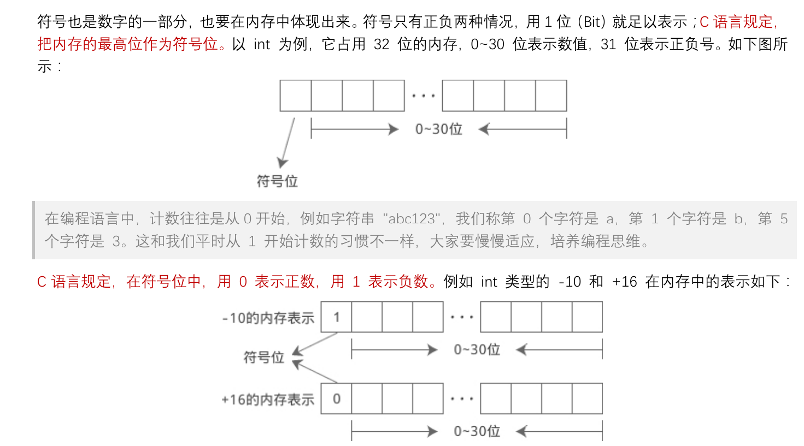
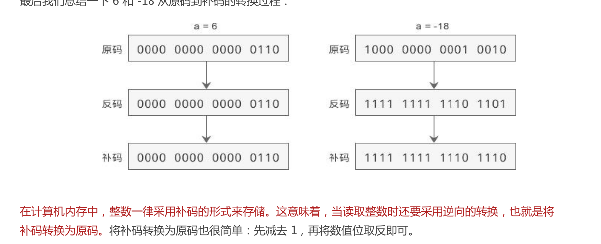

# 数据类型


## 基本数据类型

### 整型（Integer Types）

**基本整型**：
- `int`：整型，占用4个字节（32位），表示范围为-2,147,483,648到2,147,483,647。
- 让整数占用更少的内存可以在`int`前加`short`,让整数占用更多的内存可以在`int`前加`long`
- `short`可以节省内存, `long`可以容纳更大的值
- `short`的长度不能大于`int`,`long`的长度不能小于`int`

**短整型**：

- `short (int)`：短整型，通常占用2个字节（16位），表示范围为-32,768到32,767。

**长整型**：

- `long (int)`：长整型，通常占用4个字节或8个字节（64位），表示范围更大。
- `long long (int)`：长长整型，通常占用8个字节

**无符号整型**：

- `unsigned int`：无符号标准整型，表示范围为0到4,294,967,295。
- `unsigned short`：无符号短整型，表示范围为0到65,535。
- `unsigned long`：无符号长整型，表示范围更大。
- `unsigned long long`：无符号长长整型，表示范围为0到18,446,744,073,709,551,615。

整数变量声明为`unsigned`的好处是，**同样长度的内存能够表示的最大整数值，增大了一倍**。比如，16位的`signed int`最大值为32,767，而`unsigned int`的最大值增大到了65,535。

> 不同的计算机，数据类型的字节长度是不一样的。确实需要32位整数时，应使用`long`类型而不是`int`类型，可以确保不少于4个字节；确实需要64位的整数时，应该使用`long long`类型，可以确保不少于8个字节。另一方面，为了节省空间，只需要16位整数时，应使用`short`类型；需要8位整数时，应该使用`char`类型。

### 浮点型（Floating-Point Types）

#### **单精度浮点型**：

- `float`：单精度浮点型，通常占用4个字节（32位），用于表示带小数点的数值。

#### **双精度浮点型**：

- `double`：双精度浮点型，通常占用8个字节（64位），用于表示精度更高的带小数点的数值。

#### **长双精度浮点型**：

- `long double`：长双精度浮点型，通常占用16个字节（128位），用于表示更高精度的带小数点的数值。

### 字符型（Character Type）

`char`：字符型，通常占用1个字节（8位），用于表示单个字符，范围为-128到127（有符号）或0到255（无符号）。

> 在计算机内部，字符类型使用一个字节（8位）存储。C 语言将其当作整数处理，所以字符类型就是宽度为一个字节的整数。每个字符对应一个整数（由 ASCII 码确定），比如`B`对应整数`66`

字符常量必须放在单引号里面

```c
char a = 'B'; // 等同于 char a = 66;
char b = 'C'; // 等同于 char b = 67;

printf("%d\n", a + b); // 输出 133
```

> <span style="font-size:1.3em;">**转义字符**</span>
>
> 这种转义的写法，主要用来表示 ASCII 码定义的一些**无法打印**的控制字符，它们也属于字符类型的值。
>
> - `\a`：警报，这会使得终端发出警报声或出现闪烁，或者两者同时发生。
>
> - `\b`：退格键，光标回退一个字符，但不删除字符, 但是继续输入会覆盖。
>
> - `\n`：换行符。
>
> - `\r`：回车符，光标移到同一行的开头。
>
> - `\t`：水平制表符，光标移到下一个水平制表位，通常是下一个8的倍数。
>
> - `\0`：null 字符，代表没有内容。注意，这个值不等于数字0。是字符串的结束标志
>
>   > **字符串的结束标志是一个隐藏的**`\0`，但字符串的长度不包括`\0`，在创建字符数组时注意
>
> 转义写法还能使用八进制和十六进制表示一个字符。
>
> - `\dd`：字符的八进制写法，`dd`为八进制值。
> - `\xdd`：字符的十六进制写法，`ddd`为十六进制值。
>
> ```c
> char x = 'B';
> char x = 66;
> char x = '\102'; // 八进制
> char x = '\x42'; // 十六进制
> //上面示例的四种写法都是等价的
> ```

## 构造类型

复杂的类型都是基于基本数据类型构建的

### 数组（Array）
数组是一组相同类型元素的集合，**通过索引访问**。

**语法**：

```c
data_type array_name[array_size];
```

**示例**：

```c
int numbers[5]; // 定义一个包含5个整数的数组
```

### 指针（Pointer）

指针是**存储变量地址的变量**。

**语法**：
```c
data_type *pointer_name;
```

**示例**：
```c
int *ptr; // 定义一个指向整数的指针
```

### 结构体（Structure）

结构体是将不同类型的数据组合在一起的数据类型。

**语法**：

```c
struct structure_name {
    data_type member1;
    data_type member2;
    // ...
};
```

**示例**：
```c
struct Person {
    char name[50];
    int age;
    float height;
};
```

### 共用体（Union）
共用体与结构体类似，但它的所有成员**共享**同一块内存。

**语法**：

```c
union union_name {
    data_type member1;
    data_type member2;
    // ...
};
```

**示例**：
```c
union Data {
    int i;
    float f;
    char str[20];
};
```

### 枚举（Enumeration）
**枚举**是一组命名**整型常量**的集合。

**示例**：

```c
enum Color {
    RED,
    GREEN,
    BLUE
};
```

### typedef
`typedef` 用于为现有的数据类型定义新的名称。

**示例**：
```c
typedef unsigned long   ulong;
```

## 类型修饰符

### signed 和 unsigned

`signed`和`unsigned`关键字修饰**字符型**和**整型**类型的。

- `signed`关键字，表示一个类型带有正负号，包含负值；

- `unsigned`关键字，表示该类型不带有正负号，只能表示零和正整数。

  对于`int`类型，默认是带有正负号的，也就是说`int`等同于`signed int`
  由于这是默认情况，关键字`signed`一般都省略不写，但是写了也不算错。

**示例**：

```c
unsigned int u; // 无符号整型
signed char c;  // 有符号字符型
```

### short 和 long

用于改变整型数据的大小。

**示例**：

```c
short int s; // 短整型
long int l;  // 长整型
```

### 数据类型的使用示例

```c
int main() {
    // 基本数据类型
    int a = 10;
    float b = 5.5f;
    char c = 'A';

    // 数组
    int arr[3] = {1, 2, 3};

    // 指针
    int *p = &a;

    // 结构体
    struct Person {
        char name[50];
        int age;
    };
    struct Person person1 = {"John", 30};

    // 共用体
    union Data {
        int i;
        float f;
        char str[20];
    };
    union Data data;
    data.i = 10;

    // 枚举
    enum Color {RED, GREEN, BLUE};
    enum Color color = RED;

    // typedef
    typedef unsigned long ulong;
    ulong ul = 100000;

    // 输出
    printf("int: %d\n", a);
    printf("float: %f\n", b);
    printf("char: %c\n", c);
    printf("array: %d, %d, %d\n", arr[0], arr[1], arr[2]);
    printf("pointer: %d\n", *p);
    printf("struct: name = %s, age = %d\n", person1.name, person1.age);
    printf("union: %d\n", data.i);
    printf("enum: %d\n", color);
    printf("typedef: %lu\n", ul);

    return 0;
}
```

## 溢出

每种数据类型都有其数值范围，当数值超出这个范围（小于最小值或大于最大值）时会发生溢出。大于最大值称为向上溢出（overflow），小于最小值称为向下溢出（underflow）。

编译器通常不会报错，而是忽略多余的二进制位，可能导致意外结果。因此，应该尽量避免溢出。

### 示例1：向上溢出

```c
unsigned char x = 255;
x = x + 1;
printf("%d\n", x); // 输出：0
```

`x` 为 `unsigned char` 类型，最大值为 `255`。加 `1` 后溢出，`256` 的最高位被丢弃，结果为 `0`。

### 示例2：无符号整数溢出

```c
unsigned int ui = UINT_MAX;  // 4,294,967,295
ui++;
printf("ui = %u\n", ui); // 输出：0
ui--;
printf("ui = %u\n", ui); // 输出：4,294,967,295
```

`UINT_MAX` 是 `unsigned int` 类型的最大值，加 `1` 后溢出变为 `0`；减 `1` 后又变为 `UINT_MAX`。

### 易错点：循环中的溢出

```c
for (unsigned int i = n; i >= 0; --i) // 错误
```

循环变量 `i` 为 `unsigned int` 类型，最小值为 `0`，减 `1` 后变为最大值，导致无限循环。

### 避免溢出的方法

在运算前将结果与类型的极限值比较：

```c
unsigned int ui;
unsigned int sum;

// 错误
if (sum + ui > UINT_MAX) too_big();
else sum = sum + ui;

// 正确
if (ui > UINT_MAX - sum) too_big();
else sum = sum + ui;
```

### 无符号整数的减法溢出

```c
unsigned int i = 5;
unsigned int j = 7;

if (i - j < 0) // 错误
  printf("negative\n");
else
  printf("positive\n");
```

`i` 和 `j` 都是 `unsigned int` 类型，`i - j` 结果不可能小于 `0`。正确写法：

```c
if (j > i)
  printf("negative\n");
else
  printf("positive\n");
```

## 类型的自动转换

在某些情况下，C语言会自动转换某个值的类型。

#### 赋值运算

赋值运算符会自动将右边的值转换为左边变量的类型。

1. **浮点数赋值给整数变量**
   - 浮点数赋予整数变量时，C语言直接丢弃小数部分，而不是四舍五入。
   ```c
   int x = 3.14;
   printf("%d\n", x); // 输出：3
   ```

2. **整数赋值给浮点数变量**
   - 整数赋值给浮点数变量时，会自动转换为浮点数。
   ```c
   float y = 12 * 2;
   printf("%f\n", y); // 输出：24.000000
   ```

3. **窄类型赋值给宽类型**
   - 较小字节宽度的类型赋值给较大字节宽度的类型时，会自动提升类型。
   ```c
   char x = 10;
   int i = x + 5;
   printf("%d\n", i); // 输出：15
   ```

4. **宽类型赋值给窄类型**
   
   - 较大字节宽度的类型赋值给较小字节宽度的类型时，会发生**截值**
   ```c
   int i = 321;
   char ch = i; // ch 的值是 65 （321 % 256 的余值）
   printf("%d\n", ch); // 输出：65
   ```

#### 混合类型的运算

不同类型的值进行混合计算时，必须先转换为同一个类型，才能进行计算。转换规则如下：

1. **整数与浮点数混合运算**
   
   - 整数会转换为浮点数类型。
   ```c
   printf("%f\n", 3 + 1.2); // 输出：4.200000
   ```
   
2. **不同浮点数类型混合运算**
   
   - 较小宽度的类型会转换为较大宽度的类型。
   ```c
   double result = 1.2f + 2.3; // float 转为 double
   ```
   
3. **不同整数类型混合运算**
   - 较小宽度的类型会提升为较大宽度的类型。
   ```c
   short s = 10;
   int i = 20;
   long l = s + i; // short 和 int 转为 long
   ```

#### 易错点

1. **无符号与有符号整数混合运算**
   ```c
   int a = -5;
   if (a < sizeof(int))
     do_something();
   ```
   - `sizeof(int)` 是 `size_t` 类型（无符号），`a` 会自动转为无符号整数，导致比较失败。

#### 显式类型转换

为了避免自动转换带来的意外结果，可以使用显式类型转换（casting）。

```c
(unsigned char) ch
```

上面示例将变量 `ch` 转为无符号字符类型。

```c
long int y = (long int) 10 + 12;
```

上面示例中，`(long int)` 将 `10` 显式转为 `long int` 类型。


### 总结

- **自动类型转换**：C语言会在赋值和运算中自动进行类型转换，但这可能导致数据丢失或意外结果。
- **显式类型转换**：使用显式类型转换可以避免自动转换带来的问题。


# 变量和常量

---


**变量（variable）可以理解成一块内存区域的名字**。通过变量名，可以**引用这块内存区域，获取里面存储的值**。由于值可能发生变化，所以称为变量，否则就是常量了。

## 变量名

变量名在 C 语言里面属于标识符（identifier），命名有严格的规范。

- 只能由字母（包括大写和小写）、数字和下划线（`_`）组成。
- 不能以数字开头。
- 长度不能超过63个字符。

变量名区分**大小写**，`star`、`Star`、`STAR`都是不同的变量。

**关键字和保留字**也不能用作变量名。

> auto, break, case, char, const, continue, default, do, double, else, enum, extern, float, for, goto, if, inline, int, long, register, restrict, return, short, signed, sizeof, static, struct, switch, typedef, union, unsigned, void, volatile, while

另外，两个下划线开头的变量名，以及一个下划线 + 大写英文字母开头的变量名，都是系统保留的，自己不应该起这样的变量名。

## 变量的声明

**声明**（declaration）：在使用变量之前，必须对其进行声明，即向编译器描述变量。

未声明的变量直接使用会报错。

每个变量都有自己的类型，声明时需指明类型。

声明格式：**数据类型 + 变量名**

```c
int height;
```

上例中，`height` 被声明为 `int` 类型（整型）。

多个相同类型的变量可在一行声明。

```c
int height, width;
```

变量一旦声明，其类型在运行时不能修改。

## 变量的赋值

C 语言会在变量声明时，就**为它分配内存空间**，但是**不会清除内存里面原来的值**。这导致声明变量以后，变量会是一个随机的值。所以，**变量一定要赋值以后才能使用**。

赋值使用赋值运算符（`=`）：

```c
int num;
num = 42;
```

上例中，第一行声明了整数变量 `num`，第二行给它赋值。

变量的值应与其类型一致。虽然 C 语言会自动转换类型，但应避免类型不一致的赋值

变量声明和赋值可以合并（**变量的初始化**）

```c
int num = 42;
```

多个相同类型变量的赋值可以在一行完成：

```c
int x = 1, y = 2;
```

赋值表达式有返回值，等于等号右边的值：

```c
int x, y;
x = 1;
y = (x = 2 * x); // y 的值为 2，x 也被更新为 2
```

C 语言支持多重赋值：

```c
int x, y, z, m, n;
x = y = z = m = n = 3;
```

上例中，赋值从右到左执行，先为 `n` 赋值，然后依次为 `m`、`z`、`y` 和 `x` 赋值。

同一声明中可对多个变量进行初始化：

```c
int a = 10, b = 15, c = 20; // a, b, c 均被初始化
```

也可只初始化部分变量：

```c
int a, b, c = 20; // 仅 c 被初始化
```

## 变量的作用域

变量分为：

- **局域变量**：`{}`内部的变量

  > 作用域：变量所在的局部范围

- **全局变量**：`{}`外部的变量

  > 作用域：整个**工程**

**局部变量是放在内存的栈区的，全局变量是放在内存的静态区**

代码块可以嵌套，即代码块内部还有代码块，这时就形成了多层的块作用域。它的规则是：==内层代码块可以使用外层声明的变量，但外层不可以使用内层声明的变量==。如果内层的变量与外层同名，那么会在当前作用域覆盖外层变量。

- main函数内的变量都是局域变量

```c
{
  int i = 10;

  {
    int i = 20;
    printf("%d\n", i);  // 20
  }

  printf("%d\n", i);  // 10
}
```

上面示例中，内层和外层都有一个变量`i`，每个作用域都会优先使用当前作用域声明的`i`。

最常见的块作用域就是函数，函数内部声明的变量，对于函数外部是不可见的。`for`循环也是一个块作用域，循环变量只对循环体内部可见，外部是不可见的。

```c
for (int i = 0; i < 10; i++)
  printf("%d\n", i);

printf("%d\n", i); // 出错
```

上面示例中，`for`循环省略了大括号，但依然是一个块作用域，在外部读取循环变量`i`，编译器就会报错。


## 变量的存储方式

C 语言中，变量的存储方式分为**静态存储**和**动态存储**。

### 静态存储变量

- **定义时**分配存储空间，直到**程序结束**时才释放。
- 主要用于全局变量和静态局部变量。

### 动态存储变量

- **使用时**分配存储空间，用完后立即释放。
- 主要用于函数的形式参数、自动变量（非静态局部变量）、函数调用的现场保护和返回地址等。

### 内存中的存储区

内存可分为三个主要部分：

1. **程序区**
2. **静态存储区**：用于存放全局变量，在程序开始执行时分配，程序结束时释放。
3. **动态存储区**：用于存放函数的形式参数、自动变量等。

### 变量的存储类别

每个变量和函数有两个属性：数据类型和存储类别。变量的存储类别有四种：

1. **自动（auto）**
2. **静态（static）**
3. **寄存器（register）**
4. **外部（extern）**

#### 局部变量的存储类别

1. **自动变量（auto）**：
   - **默认的局部变量类型**，动态分配存储空间，数据存储在动态存储区。
   - 声明使用 `auto` 关键字（通常省略）。

2. **静态局部变量（static）**：
   - **在函数调用结束后值不消失，保留到下一次调用**。
   - 使用 `static` 关键字声明。

3. **寄存器变量（register）**：
   - 为提高执行效率，将局部变量存放在 CPU 寄存器中。
   - 声明使用 `register` 关键字。

#### 全局变量的存储类别

- **外部变量（extern）**：在一个文件内定义的变量可通过 `extern` 关键字在其他文件中引用。未使用 `extern` 声明的外部变量作用域仅限于定义它的文件。

### 注意事项

- 关键字 `auto`、`register` 和 `static` 必须与变量定义一起使用，不能单独使用。

## 常量

### 1. 字面常量

- **十进制整数**：如 `123`
- **八进制整数**：以 `0` 开头，如 `0123`
- **十六进制整数**：以 `0x` 或 `0X` 开头，如 `0x123`
- **浮点数**：如 `3.14`
- **字符**：如 `'a'`
- **字符串**：如 `"abcde\0"`

### 2. `const`修饰的常变量：**值不能变的量**

   ```c
const int a = 10;
   ```

   `const`的作用：

- **只读特性**：保护变量值不被修改

- **节省空间**：避免不必要的内存分配，`const` 修饰的变量在程序运行过程中只有一份拷贝。

- **提高程序运行效率**：编译器不为普通`const`常量分配存储空间，而是将他们保存在符号表中，这使得它成为一个编译期间的常量，没有了存储和读取内存的操作。

### 3. `#define`定义的标识符常量：**文本替换**

   用于定义常量，为一个常量指定一个名称

   ```c
#define 常量名称  常量	//把所有的名称都替换为对应内容
   ```

`#define `是**预处理**指令，用于**定义宏**。宏是一种标识符，用于表示一个字符串，可以在编译前进行替换。`#define `有两种格式，一种是**不带参数的宏定义**，另一种是**带参数的宏定义**。

- 不带**参数**的宏定义的格式是：

```c
#define <宏名> <字符串>
```

这种格式用于定义一个**常量**或一个**表达式**，例如：

```c
#define PI 3.14159 // 定义一个圆周率常量
#define MAX(a, b) ((a) > (b) ? (a) : (b)) // 这个宏定义了一个名为MAX的宏函数，用于返回两个值中的较大者。在代码中使用MAX(x, y)时，会被替换成((x) > (y) ? (x) : (y))。
```

- 带**参数**的宏定义的格式是：

```c
#define 宏名(参数列表) 替换文本
```

可以实现类似于函数的功能，但是不需要调用函数

这种格式用于定义一个类似于函数的宏，可以传递参数，例如：

```c
#define SQUARE(x) ((x) * (x)) // 定义一个求平方的宏
#define SUM(x, y) ((x) + (y)) // 定义一个求和的宏
```

> #define 的注意事项有以下几点：
>
> - 宏名一般用**大写**，以便于区分变量和函数。
> - 宏定义的末尾不需要分号
> - 宏定义中的**参数**和**表达式**要用**括号**括起来，以防止运算符优先级的影响。
> - 宏替换只是简单的文本替换，不做任何计算和类型检查，可能会产生一些意想不到的结果，要谨慎使用。
> - 可以用 #undef 命令取消宏定义的作用域，或者用 #ifdef、#ifndef、#else、#endif 等命令进行条件编译。

#### `const` vs `#define`

> `const` 和 `#define` 虽然都用于定义常量，但有明显的不同：
>
> 1. **预处理 vs 编译**：
>
>   - **`#define`**：是一种预处理指令，宏在预处理阶段（编译前）展开。它是简单的文本替换，不进行任何类型检查。
> - **`const`**：是变量定义，在编译阶段和运行阶段使用。编译器会对其进行类型检查和优化。
>
> 2. **内存分配**：
>    - `#define` 定义的宏在编译后不存在，不占用内存。
>    - `const` 定义的常变量在内存中占用存储单元，具有类型和变量属性。
> 3. **类型检查**：
>    - `#define` 定义的宏没有类型，纯文本替换，无类型安全检查，容易出错。
>    - `const` 定义的变量有类型，编译器可进行类型检查，更安全。
>
> 在定义常量时，优先使用 `const` 关键字，因为它提供了更好的类型检查和内存管理。在需要条件编译或简单文本替换的特定情况下，可以使用 `#define`

### 4. 枚举常量：可以一一列举的常量

枚举常量是一种用户自定义数据类型，主要用于为一组相关的**整数常量**赋予有意义的名字，从而使程序更加易读和易维护。枚举类型使用`enum`关键字定义。

```c
enum　枚举名　{枚举元素1,枚举元素2,……};	
//枚举常量的值默认从0开始
```

比如：一星期有 7 天，如果不用枚举，我们需要使用 #define 来为每个整数定义一个别名：

```c
#define MON  1 
#define TUE  2 
#define WED  3 
#define THU  4 
#define FRI  5
#define SAT  6 
#define SUN  7
```

这个看起来代码量就比较多，接下来我们看看使用枚举的方式：

```c
enum DAY
{
      MON=1, TUE, WED, THU, FRI, SAT, SUN
};
/*注意：第一个枚举成员的默认值为整型的 0，后续枚举成员的值在前一个成员上加 1。我们在这个实例中把第一个枚举成员的值定义为 1，第二个就为 2，以此类推。*/
```

#### 使用枚举类型

定义枚举类型后，可以声明该类型的变量并赋值：

```c
enum DAY today;
today = WED;

if (today == WED) {
    printf("It's Wednesday.\n");
}
```

> 可以在定义枚举类型时**改变枚举元素的值**：
>
> ```c
> enum season {spring, summer=3, autumn, winter};
> ```
>
> **没有指定值的枚举元素，其值为前一元素加 1**。也就说 spring 的值为 0，summer 的值为 3，autumn 的值为 4，winter 的值为 5


## C 语言中的二进制数、八进制数和十六进制数

表示一个二进制、八进制或者十六进制数字, 为了和十进制数字区分开来, 必须采用某种特殊的写法,具体来说,就是在数字前面加上特定的字符,也就是加前缀。

<span style="font-size:1.3em;">1. 二进制数（Binary Numbers）</span>

**表示**：二进制数使用 `0` 和 `1` 两个数字，前缀为 `0b` 或 `0B`。

**示例**：

```c
int binaryNumber = 0b1010; // 表示二进制数 1010，相当于十进制的 10
```

**输出**：C语言标准库没有直接输出二进制数的格式，可以通过自定义函数实现

<span style="font-size:1.3em;">2. 八进制数（Octal Numbers）</span>

**表示**：八进制数使用 `0` 到 `7` 八个数字，前缀为 `0`。

**示例 : **

```c
int octalNumber = 012;// 表示八进制数 12，相当于十进制的 10
printf("%o\n", octalNumber); // 输出：12
```

<span style="font-size:1.3em;">3. 十六进制数（Hexadecimal Numbers）</span>

**表示**：十六进制数使用 `0` 到 `9` 和 `A` 到 `F`（或 `a` 到 `f`）共16个数字，前缀为 `0x` 或 `0X`。

**示例 : **

```c
int hexNumber = 0xA;// 表示十六进制数 A，相当于十进制的 10
printf("%x\n", hexNumber); // 输出：a
printf("%X\n", hexNumber); // 输出：A
```

- **二进制数**：前缀 `0b` 或 `0B`，输出时需要自定义函数。
- **八进制数**：前缀 `0`，使用 `%o` 格式输出。
- **十六进制数**：前缀 `0x` 或 `0X`，使用 `%x` 或 `%X` 格式输出。


## C 语言中的正负数及其输出

<span style="font-size:1.3em;">正负数的表示</span>

​	在C语言中，`short`、`int`、`long`等类型的变量可以表示正数和负数。正数默认不带符号，负数以负号 `-` 开头

<span style="font-size:1.3em;">符号位</span>

​	整数类型默认带符号位。以 `int` 为例，它占用32位内存，其中31位表示数值，最高位（第31位）表示符号：**`0` 表示正数，`1` 表示负数。**



<span style="font-size:1.3em;">3. 无符号数</span>

short、int 和 long 类型默认都是带符号位的, 符号位以外的内存才是数值位。如果只考虑正数,那么各种类型能表示的数值范围(取值范围)就比原来小了一半。

如果确定某个数字只能是正数，可以使用 `unsigned` 关键字。这样**符号位将被移除**，所有位都用来表示数值，范围更大(大一倍)。

```c
unsigned short a = 12;
unsigned int b = 1002;
unsigned long c = 9892320;
```

无符号数的输出

无符号数可以以八进制、十进制和十六进制的形式输出，格式控制符如下：

| 类型             | 八进制 | 十进制 | 十六进制       |
| ---------------- | ------ | ------ | -------------- |
| `unsigned short` | `%ho`  | `%hu`  | `%hx` 或 `%hX` |
| `unsigned int`   | `%o`   | `%u`   | `%x` 或 `%X`   |
| `unsigned long`  | `%lo`  | `%lu`  | `%lx` 或 `%lX` |

<span style="font-size:1.3em;">有符号数的输出</span>

- `%d`：以十进制形式输出有符号数。
- `%u`：以十进制形式输出无符号数。
- `%o`：以八进制形式输出无符号数。
- `%x`：以十六进制形式输出无符号数。

**注意**：`printf` 不支持以八进制或十六进制形式输出有符号数。

#### 6. 示例代码

```c
int main() {
    short a = 0100; // 八进制
    int b = -0x1; // 十六进制
    long c = 720; // 十进制

    unsigned short m = 0xffff; // 十六进制
    unsigned int n = 0x80000000; // 十六进制
    unsigned long p = 100; // 十进制

    // 以无符号形式输出有符号数
    printf("a=%#ho, b=%#x, c=%ld\n", a, b, c);
    // 以有符号数形式输出无符号类型（只能以十进制形式输出）
    printf("m=%hd, n=%d, p=%ld\n", m, n, p);

    return 0;
}
```

- **正负数表示**：负数以 `-` 开头，正数默认不带符号。
- **符号位**：整数类型默认带符号位，最高位表示正负。
- **无符号数**：使用 `unsigned` 关键字移除符号位，扩大取值范围。
- **格式控制符**：`%d` 输出有符号数，`%u`、`%o`、`%x` 输出无符号数。

## 整数在内存中的存储

**背景**: 加法和减法是计算机中的基本运算，为了简化硬件电路设计，提高运算效率，计算机采用统一的**加法运算方式来处理加法和减法**。这就要求计算机能够有效地处理正数和负数。

**关键概念:** 

- **原码**：整数的原始二进制表示。最高位为符号位，0表示正数，1表示负数。

  ```c
  short a = 6;  // 原码: 0000 0000 0000 0110
  a = -18;      // 原码: 1000 0000 0001 0010
  ```

- **反码**：负数的反码是将原码中数值位取反（符号位不变）。

  ```c
  short a = 6;  // 反码: 0000 0000 0000 0110
  a = -18;      // 反码: 1111 1111 1110 1101
  ```

- **补码**：负数的补码是反码加1。补码表示法简化了硬件电路设计，使得加减法运算可以统一处理。

  ```c
  short a = 6;  // 补码: 0000 0000 0000 0110
  a = -18;      // 补码: 1111 1111 1110 1110
  ```



> 补码的优势
>
> - **简化硬件电路**：补码表示法统一了正负数的处理，使硬件电路无需区分符号位和数值位。
> - **统一加减运算**：减法可以转换为加法，例如：`5 - 3` 等价于 `5 + (-3)`。
>
> 补码的存储和读取
>
> 计算机内存中，**整数以补码形式存储**。读取时，负数的补码需转换为原码：减去1并取反。


补码运算示例

- **6 - 18**：

  ```c
  6 - 18 = 6 + (-18)
  = [0000 0000 0000 0110]补 + [1111 1111 1110 1110]补
  = [1111 1111 1111 0100]补
  = -12
  ```

- **18 - 6**：

  ```c
  18 - 6 = 18 + (-6)
  = [0000 0000 0001 0010]补 + [1111 1111 1111 1010]补
  = [0000 0000 0000 1100]补
  = 12
  ```

补码解决了反码计算中相差1的问题，使得加减法运算统一且高效。其设计简化了硬件电路，使计算更高效。
