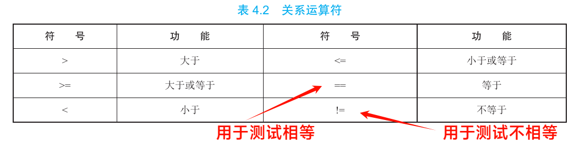
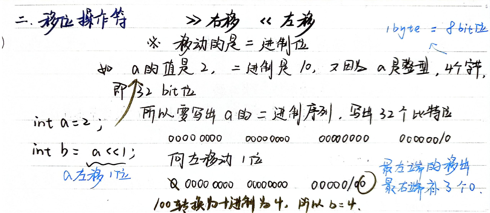
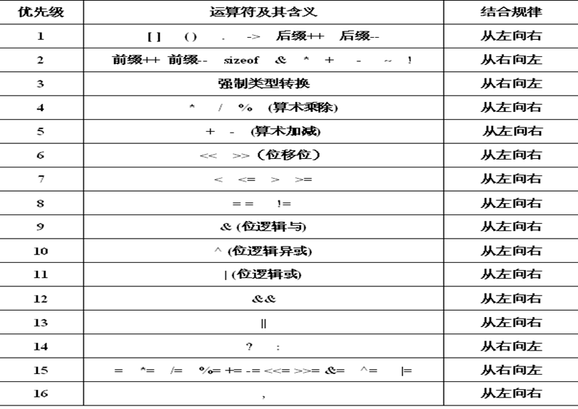

# 运算符

## 算术运算符

```
+	-	*   /	  %
加  减  乘   除  取余/取模
```

- 运算符`/`用来完成除法。注意，**两个整数相除，得到还是一个整数**。(**相当于除法求的结果是商而不含余数**)

  - 两端只要有一个是浮点数,就执行浮点数的除法

  ```c
  float x = 6 / 4;
  printf("%f\n", x); // 输出 1.000000
  ```

  下面是另一个例子。

  ```c
  int score = 5;
  score = (score / 20) * 100;
  ```

  上面的代码，你可能觉得经过运算，`score`会等于`25`，但是实际上`score`等于`0`。这是因为`score / 20`是整除，会得到一个整数值`0`，所以乘以`100`后得到的也是`0`。

  为了得到预想的结果，可以将除数`20`改成`20.0`，让**整除变成浮点数除法。**

  ```c
  score = (score / 20.0) * 100;
  ```

  

- `%` 取模运算时,返回两个整数相除的余值. 取模运算符只能用于整数,不能用于浮点数

  - 负数取模的规则是, 结果的正负号由**第一个**运算数的正负号决定

  ```c
  11 % -5 // 1
  -11 % -5 // -1
  -11 % 5 // -1
  ```

  

## 关系运算符

用于比较的表达式，称为“关系表达式”，里面使用的运算符就称为“关系运算符”

- 关系运算符主要用于对两边表达式的值进行大小比较, 返回一个**真值(1)或假值(0)**, 返回真值表示指定的关系成立,返回假值表示指定的关系不成立。

- **关系表达式要么返回`0`要么`1`**，表示真伪。C 语言中，**`0`表示伪，所有非零值表示真**。比如，`20 > 12`返回`1`，`12 > 20`返回`0`。

- 关系表达式常用于`if`或`while`结构。

- 比较运算符“`==`”不能误写成“`=`” 

- 多个**关系运算符不宜连用**。

  ```c
  i < j < k   //期望判断j是否大于i，且小于k
  ```

  这是合法表达式，不会报错，但是通常达不到想要的结果，即不是保证变量 j 的值在 i 和 k 之间。比如

  ```c
  (i < j) < k; //i < j 返回 0 或 1 ，所以最终是 0 或 1 与变量 k 进行比较
  ```

  上面式子中，`i < j`返回`0`或`1`，所以最终是`0`或`1`与变量`k`进行比较。如果想要判断变量`j`的值是否在`i`和`k`之间，应该使用下面的写法。

  ```c
  i < j && j < k
  ```


## 逻辑运算符

逻辑运算符提供逻辑判断功能，用于构建更复杂的表达式，主要有下面三个运算符。

- `!`：逻辑否（改变单个表达式的真伪）。
- `&&`：逻辑与（两侧的表达式都为真，则为真，否则为伪）。
- `||`：逻辑或（两侧至少有一个表达式为真，则为真，否则为伪）

| a       | b       | a && b  | a \|\| b | !a      |
| ------- | ------- | ------- | -------- | ------- |
| 1（真） | 1（真） | 1（真） | 1（真）  | 0（假） |
| 1（真） | 0（假） | 0（假） | 1（真）  | 0（假） |
| 0（假） | 1（真） | 0（假） | 1（真）  | 1（真） |
| 0（假） | 0（假） | 0（假） | 0（假）  | 1（真） |

```c
int x = 5;
int y = 11;
if (x < 10 && y > 20)
    printf("今天天气真晴朗\n");
```

下面是否运算符的例子。

```c
if (!(x < 12))
  printf("x is not less than 12\n");
```

> 对于逻辑运算符来说，任何非零值都表示真，零值表示伪。比如，`5 || 0`会返回`1`，`5 && 0`会返回`0`。

**短路现象**: 逻辑运算符还有一个特点，它总是先对左侧的表达式求值，再对右边的表达式求值，这个顺序是保证的。如果左边的表达式满足逻辑运算符的条件，就不再对右边的表达式求值。这种情况称为“**短路**”。

```c
if (number != 0 && 12/number == 2)
```

上面示例中，如果`&&`左侧的表达式（`number != 0`）为伪，即`number`等于`0`时，右侧的表达式（`12/number == 2`）是不会执行的。因为这时左侧表达式返回`0`，整个`&&`表达式肯定为伪，就直接返回`0`，不再执行右侧的表达式了，不会发生除以0错误。

由于逻辑运算符的执行顺序是**先左后右**，所以下面的代码是有问题的。

```c
while ((x++ < 10) && (x + y < 20))
```

上面示例中，执行左侧表达式后，变量`x`的值就已经变了。等到执行右侧表达式的时候，是用新的值在计算，这通常不是原始意图。

```c
短路:
a&&b
    a=0, 右边不再计算
a||b
    a为真, 右边不在计算
```


## 赋值运算符

- 符号 = 
  - 当“=”两侧数据类型不一致时，可以使用自动类型转换或使用强制类型转换原则进行处理。
  - 支持`连续赋值`。
- 扩展赋值运算符： +=、 -=、*=、 /=、%=

| 运算符 |    名称    | 实例 | 展开形式 |
| :----: | :--------: | :--: | :------: |
|   +=   | 复合加赋值 | a+=b |  a=a+b   |
|   -=   | 复合减赋值 | a-=b |  a=a-b   |
|   *=   | 复合乘赋值 | a*=b |  a=a*b   |
|   /=   | 复合除赋值 | a/=b |  a=a/b   |
|   %=   | 复合模赋值 | a%=b |  a=a%b   |

## 位运算符

- C 语言提供一些位运算符，用来操作二进制位（bit）。

- 位运算符的运算过程都是基于二进制的补码运算。


- **按位取反 `~`**：将每个二进制位取反。
- **按位与 `&`**：只有当两个对应位都为 `1` 时，结果位才为 `1`。
- **按位或 `|`**：只要有一个对应位为 `1`，结果位就为 `1`。
- **按位异或 `^`**：当且仅当两个对应位有一个为 `1` 时，结果位才为 `1`。

### 取反 ~

取反运算符 `~` 是一个一元运算符，用于将每个二进制位取反，即 `0` 变为 `1`，`1` 变为 `0`。

```c
unsigned char a = 0b10010011; // 二进制：10010011
unsigned char result = ~a;    // 取反后：01101100
printf("Result: %u\n", result); // 输出：108
```

### 按位与 &

按位与运算符 `&` 将两个值的每个二进制位进行比较，只有当两个对应位都为 `1` 时，结果位才为 `1`，否则为 `0`。

```c
unsigned char a = 0b10010011; // 二进制：10010011
unsigned char b = 0b00111101; // 二进制：00111101
unsigned char result = a & b; // 结果：00010001
printf("Result: %u\n", result); // 输出：17
```

### 按位或 |

按位或运算符 `|` 将两个值的每个二进制位进行比较，只要有一个对应位为 `1`，结果位就为 `1`，否则为 `0`。

```c
unsigned char a = 0b10010011; // 二进制：10010011
unsigned char b = 0b00111101; // 二进制：00111101
unsigned char result = a | b; // 结果：10111111
printf("Result: %u\n", result); // 输出：191
```

### 按位异或 ^

按位异或运算符 `^` 将两个值的每个二进制位进行比较，当且仅当两个对应位有一个为 `1` 时，结果位才为 `1`，否则为 `0`。

```c
unsigned char a = 0b10010011; // 二进制：10010011
unsigned char b = 0b00111101; // 二进制：00111101
unsigned char result = a ^ b; // 结果：10101110
printf("Result: %u\n", result); // 输出：174
```

## 移位运算符



## 逗号运算符

逗号隔开的一串表达式, 从左到右依次进行计算每个表达式, 整个表达式的返回值取最右侧表达式的结果


## 单目运算符

单目运算符是只需要一个操作数的运算符

1. `!`：逻辑非运算符，将真值变为假值，假值变为真值。
2. `-` `+`：负号和正号运算符，分别表示取负和取正。
3. `&`：**取地址运算符**，**返回变量的地址**。
4. `sizeof`：返回操作数的数据类型或变量的大小（以**字节**为单位）。
5. `~`：按位取反运算符，将每个二进制位取反。
6. `--` `++`：自减和自增运算符，分别将变量的值减1和加1。
   - **前置++**: 先加1, 后使用
   - **后置++**: 先使用, 后加1
7. `*`：间接访问运算符或解引用运算符，访问指针所指向的变量。
8. `(类型)`：强制类型转换运算符，将表达式转换为指定类型。

## 条件操作符

- **条件操作符 `? :`**     根据条件表达式的结果选择执行两个表达式中的一个。
- **语法**：`condition ? expression1 : expression2`
- **用途**：简化代码，减少 `if-else` 语句的使用。

- `condition`：这是一个布尔表达式。如果 `condition` 为真（非零），则计算并返回 `expression1` 的值；如果 `condition` 为假（零），则计算并返回 `expression2` 的值。

基本用法

```c
int x = 10, y = 20;
int max = (x > y) ? x : y; // 如果 x > y 为真，max = x，否则 max = y
printf("Max value is %d\n", max); // 输出：Max value is 20
```

在这个例子中，`(x > y) ? x : y` 用于判断 `x` 是否大于 `y`，如果是，则返回 `x`，否则返回 `y`。

嵌套使用

获取三个数中的最大值: 

```c
int main() {
    int n1 = 23;
    int n2 = 13;
    int n3 = 33;
    //写法1：
    int tempMax = (n1 > n2)? n1:n2;
    int finalMax = (tempMax > n3)? tempMax : n3;
    printf("三个数中最大值为%d\n",finalMax);

    //写法2：不推荐，可读性差
    int finalMax1 = (((n1 > n2)? n1:n2) > n3)? ((n1 > n2)? n1:n2) : n3;
    printf("三个数中最大值为%d\n",finalMax1);

    return 0;

}
```


## 运算符优先级

优先级：算术运算符 > 关系运算符 > 逻辑运算符 > 赋值运算符。逻辑运算符中“逻辑非 !”除外



参考:

[C语言运算符优先级和结合性一览表](https://c.biancheng.net/view/161.html)

