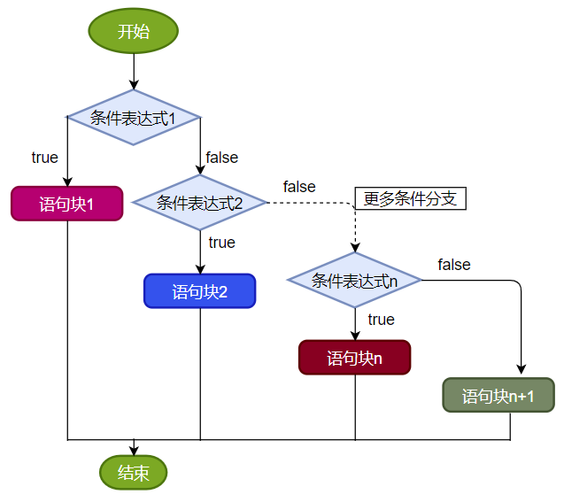
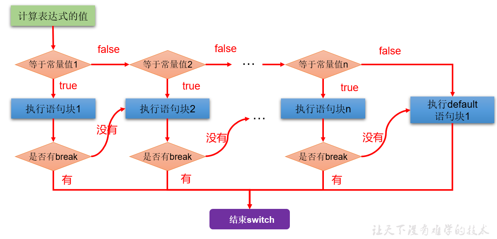
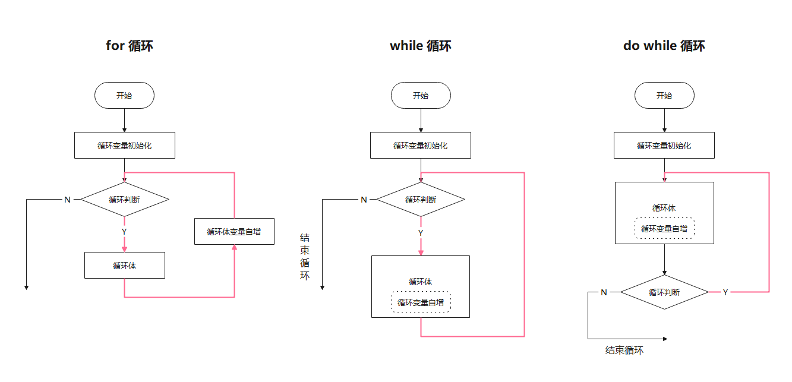
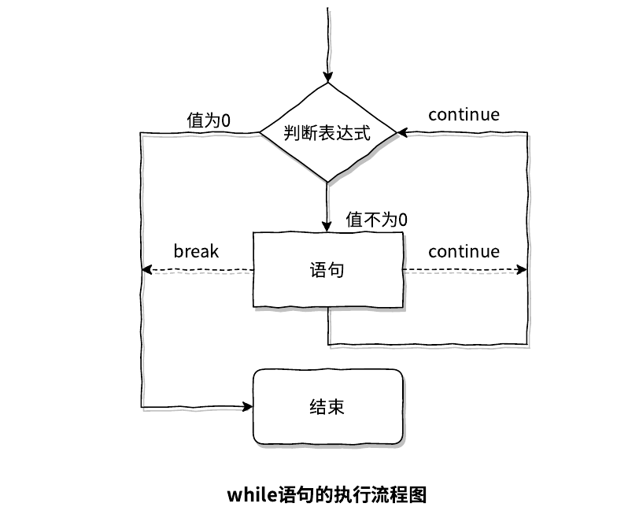
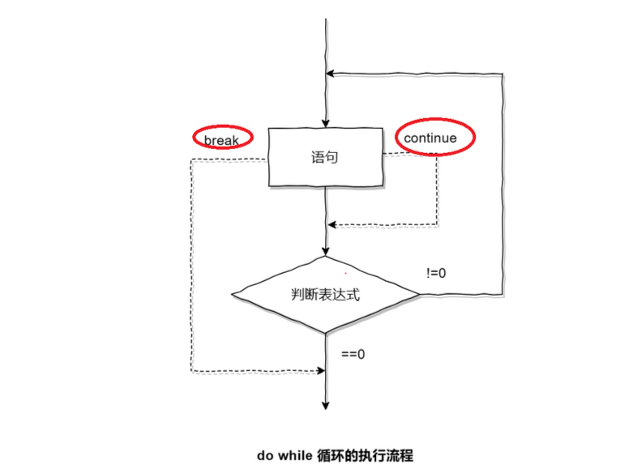

# 流程控制结构

程序设计中规定的`三种`流程结构，即：

- **顺序结构**
  - 程序从上到下逐行地执行，中间没有任何判断和跳转。
- **分支结构**
  - 根据条件，选择性地执行某段代码。
  - 有`if…else`和`switch-case`两种分支语句。
- **循环结构**
  - 根据循环条件，重复性的执行某段代码。
  - 有`for`、`while`、`do-while`三种循环语句。

## 选择语句(分支语句)

### if 语句

`if`语句用于条件判断，当条件满足时执行指定的语句。

```c
if(条件表达式)｛
    语句块;
｝
```

`执行流程：`条件表达式为真（值不为 0 ）时，就执行语句块。

`statement`可以是单个语句，也可以是包含在大括号中的复合语句。

当变量`x`等于10时，输出`x is 10`。对于单行语句，通常另起一行书写：

```c
if (x == 10)
    printf("x is 10\n");
```

如果有多条语句，需要用大括号括起来

### else 分支

`if`语句可以带有`else`分支，当条件不满足时执行`else`部分的语句。

```c
if (i > j) {
    max = i;
    printf("i is greater than j\n");
} else {
    max = j;
    printf("j is greater than i\n");
}
```

### else if 



`else if`用于**多重条件判断**：

```c
if (score >= 90)
    grade = 'A';
else if (score >= 80)
    grade = 'B';
else if (score >= 70)
    grade = 'C';
else
    grade = 'F';
```

> 当条件表达式之间是“`互斥`”关系时（即彼此没有交集），条件判断语句及执行语句间顺序无所谓。
>
> 当条件表达式之间是“`包含`”关系时，“`小上大下 / 子上父下`”，否则范围小的条件表达式将不可能被执行。

### If语句的嵌套


如果有多个`if`和`else`, `else`总是跟最接近的`if`匹配


### 条件运算符 ? : 

条件运算符(三目运算符) `? :`是`if...else`的简写形式。

```c
<expression1> ? <expression2> : <expression3>
```

当`expression1`为真时，执行`expression2`，否则执行`expression3`。

示例：

```c
max = (i > j) ? i : j;
```

等同于：

```c
if (i > j)
    max = i;
else
    max = j;
```

### switch 语句

switch 语句用于判断条件有多个常量结果的情况。它把多重的 else if 改成更易用、可读性更好的形式。

```c
switch(表达式){
    case 常量值1: 
        语句块1;
        //break;
    case 常量值2: 
        语句块2;
        //break;
    ┇ ┇
    case 常量值n: 
        语句块n; 
        //break;
    [default: 
        语句块n+1;
    ]
}
```



根据`expression`的值执行相应的`case`分支，如果没有匹配的值则执行`default`分支。

```c
switch (grade) {
    case 'A':
        printf("Excellent\n");
        break;
    case 'B':
        printf("Good\n");
        break;
    case 'C':
        printf("Average\n");
        break;
    default:
        printf("Fail\n");
}
```

**注意事项 :**

- 每个`case`分支的结尾应有`break`语句，以防止“贯穿”执行到下一个`case`。如果缺少`break`，就会导致继续执行下一个`case`或`default`分支。

- 如果多个`case`分支对应同样的语句体，可以省略中间的`break`：

  > - 注意1：switch语句中表达式类型只能是整型或者字符型。
  > - 注意2：case里如果没有break，那么程序会一直向下执行。
  > - 总结：与if语句比，对于多条件判断时，switch的结构清晰，执行效率高，缺点是switch不可以判断区间。

```c
switch (grade) {
    case 'A':
    case 'B':
    case 'C':
        printf("Passed\n");
        break;
    default:
        printf("Failed\n");
}
```

- `default`分支是可选的，用于处理所有未匹配的情况，通常放在最后。
- 当判定的情况占少数时, if...else 语句比 switch 语句的检验速度快、效率高。也就是说, 如果分支不多于 4 个, 则使用 if...else 语句,否则使用 switch 语句




## 循环结构

### while 循环



`while`语句用于实现循环结构，当条件满足时，反复执行循环体。

```c
①初始化部分
while(②循环条件部分)｛
    ③循环体部分;
    ④迭代部分;
}
```

**执行过程：**①-②-③-④-②-③-④-②-③-④-...-②

注意不要忘记声明④迭代部分。否则，循环将不能结束，变成死循环。


遍历1-100的偶数，并计算所有偶数的和、偶数的个数（累加的思想）:

```c
int main() {
    //遍历1-100的偶数，并计算所有偶数的和、偶数的个数（累加的思想）
    int num = 1;

    int sum = 0;//记录1-100所有的偶数的和
    int count = 0;//记录1-100之间偶数的个数

    while (num <= 100) {

        if (num % 2 == 0) {
            printf("%d\n", num);
            sum += num;
            count++;
        }

        //迭代条件
        num++;
    }

    printf("偶数的总和为：%d\n", sum);
    printf("偶数的个数为：%d\n", count);
    return 0;
}
```


**无限循环 :** 只要条件始终为真，`while`循环会产生无限循环。以下是一个常见的无限循环示例：

```c
while (1) {
    // 无限循环体
}
```

尽管这是一个无限循环，但可以使用`break`语句在特定条件下跳出循环：

```c
int i = 0;
while (1) {
  printf("i is now %d!\n", i);
  if (i >= 10) 
    break;
  i++;
}
printf("All done!\n");
```

在这个示例中，当`i`大于或等于10时，`break`语句会跳出循环。


**一般来说用 while循环用于倒数或者不清楚循环次数的遍历**

```c
int n=10; 
while(n>0)
{
  printf("我是大帅比\n");
  n--;
}
```


### do...while 循环



`do...while`结构是`while`循环的变体，区别在于它会先执行一次循环体，然后再判断条件是否满足。如果条件满足，则继续执行循环体；否则，跳出循环。

```c
①初始化部分;
do{
    ③循环体部分
    ④迭代部分
}while(②循环条件部分); 
```

**执行过程：**①-③-④-②-③-④-②-③-④-...-②

在上述语法中，无论`expression`是否为真，循环体`statement`至少会执行一次。每次`statement`执行完毕后，都会判断`expression`，决定是否继续循环。

```c
int i = 10;
do {
    --i;
} while (i > 0);
```

在这个示例中，变量`i`先减去1，然后判断是否大于0。如果大于0，则继续减去1，直到`i`等于0为止。


> `do...while`语句确保循环体至少执行一次，然后根据条件决定是否继续循环。它适用于需要至少执行一次循环体的场景

### for 循环

- `for`语句通常用于**精确控制循环次数**

```c
for (①初始化部分; ②循环条件部分; ④迭代部分)｛
            ③循环体部分;
｝
```

**执行过程：**①-②-③-④-②-③-④-②-③-④-.....-②

- **初始化部分**：用于初始化循环变量，只执行一次。可以声明多个变量，但必须是同一个类型，用逗号分隔
- **判断表达式**：每次循环开始前进行判断，如果为真，则执行循环体；如果为假，则退出循环。
- **更新表达式**：每次循环**结束后执行**，用于**更新循环控制变量**。

> 循环其实就是重复的做一件事，在这个同时我们还要规定循环的次数（就是重复做多少遍），我们数数的过程是不是就相当于记录次数了，循环也就是这样。

```c
for(从几开始数 ；数到几结束 ；数增加或减少）
{
  我们重复干的事
}
```

至于使用，最简单的也就是重复输出一句话了。

```c
int n = 10; // 规定循环多少次
for(int i=0;i<n;i++)
{
    printf("重复做的事\n");
}
```

> 1. 首先就是执行 `int i = 0`（这句话只会在刚开始循环时执行一遍，后面就不会执行了）
> 2. 然后执行循环控制语句（i<n）
>    - 如果循环控制语句为真（此时 i < n），执行循环体（就是那句输出语句）
>    - 如果循环控制语句为假（此时 i >= n），结束本次循环执行增值表达式（i++）
> 3. 继续从 2 开始往下执行（直到循环控制语句为假，退出循环）

注意这里，用了个临时变量 i 来控制循环的次数，并且是在括号内定义的，这样的好处很多（比在for外面定义好）:

1. **作用域更小**：`i` 的作用域仅限于 `for` 循环内部，避免了意外修改和命名冲突。
2. **代码清晰**：更容易理解 `i` 仅用于此循环，代码可读性更高

#### 详细说明

- **初始化表达式**：可以是一个或多个表达式，使用逗号分隔。例如：

  ```c
  for (int i = 0, j = 0; i < 10; i++, j++) {
      // 循环体
  }
  ```

- **条件表达式**：可以是任意一个返回布尔值的表达式。也可以省略，但省略后会一直被**视为真**，形成无限循环。例如：

  ```c
  for (int i = 0;; i++) {
      if (i >= 10) break;
      printf("%d\n", i);
  }
  ```

- **更新表达式**：同样可以是一个或多个表达式，使用逗号分隔。例如：

  ```c
  for (int i = 0; i < 10; i++, j--) {
      // 循环体
  }
  ```

  #### 特殊用法

  - **嵌套`for`循环**：`for`循环可以嵌套使用。例如：

  ```c
  for (int i = 0; i < 3; i++) {
      for (int j = 0; j < 3; j++) {
          printf("i = %d, j = %d\n", i, j);
      }
  }
  
  /*i = 0, j = 0
  i = 0, j = 1
  i = 0, j = 2
  i = 1, j = 0
  i = 1, j = 1
  i = 1, j = 2
  i = 2, j = 0
  i = 2, j = 1
  i = 2, j = 2*/
  ```

  - **省略部分表达式**：可以省略初始化和更新表达式。例如：

  ```c
  int i = 0;
  for (; i < 10;) {
      printf("%d\n", i);
      i++;
  }
  ```
  
  #### 注意事项
  
  - **死循环**：如果条件表达式永远为真，或者**忘记更新循环控制变量**，可能会导致死循环。例如：
  
  ```c
  for (int i = 0; i < 10;) {
      printf("%d\n", i);
      // 忘记更新i
  }
  ```
  
  - **作用域**：在`for`循环中声明的变量，其作用域仅限于循环内部。例如：
  
  ```c
  for (int i = 0; i < 10; i++) {
      // i 仅在这里有效
  }
  // 这里无法访问i
  ```
  
  #### 小结：三种循环结构
  
  - **三种循环结构都具有四个要素：**
    - 循环变量的初始化条件
    - 循环条件
    - 循环体语句块
    - 循环变量的修改的迭代表达式
  
  * **从循环次数角度分析**
    * do-while循环至少执行一次循环体语句。
    * for和while循环先判断循环条件语句是否成立，然后决定是否执行循环体。
  * **如何选择**
    * 遍历有明显的循环次数（范围）的需求，选择for循环
    * 遍历没有明显的循环次数（范围）的需求，选择while循环
    * 如果循环体语句块至少执行一次，可以考虑使用do-while循环
    * 本质上：三种循环之间完全可以互相转换，都能实现循环的功能
  
  ### 实际应用
  
  `for`循环在主要用于需要重复执行某些操作的场景，比如**遍历数组**、处理集合等
  
  
  
  有时在我们执行循环的时候并不知道具体的循环次数，或者我们想要剔除某种特殊的情况，这就需要用到循环的两个小跟班了（break和continue）


### 转向语句

| 关键字   | 适用范围    | 循环结构中的作用                     | 相同点                       |
| -------- | ----------- | ------------------------------------ | ---------------------------- |
| break    | switch-case | -                                    | -                            |
| break    | 循环结构    | 一旦执行，就结束(或跳出)当前循环结构 | 此关键字的后面，不能声明语句 |
| continue | 循环结构    | 一旦执行，就结束(或跳出)当次循环结构 | 此关键字的后面，不能声明语句 |

#### break 语句

  - **用途**：`break`语句主要有两种用途：

    1. 在`switch`语句中中断当前分支执行；

    2. 在循环体（如`for`、`while`、`do-while`循环）中跳出整个循环。(永久的**终止循环)**

  - **示例**：

    - 在嵌套`for`循环中，`break`可用于只跳出**最内层**的循环。

    ```c
    for (int i = 0; i < 3; i++) {
        for (int j = 0; j < 3; j++) {
            printf("%d, %d\n", i, j);
            break; // 仅跳出内层循环
        }
    }
    /*0, 0
      1, 0
      2, 0*/
    ```

    - 在`while`循环中，遇到特定条件（如读到换行符）使用`break`跳出循环。

    ```c
    while ((ch = getchar()) != EOF) {
        if (ch == '\n') break;
        putchar(ch);
    }
    ```

#### continue 语句

  - **用途**：`continue`语句用于立即终止**本次**循环，直接跳到循环的下一次迭代。

  - **示例**：

    - 在`for`循环中，`continue`可能**不会**改变执行流程，因为它仅跳到下一次迭代。

    ```c
    for (int i = 0; i < 3; i++) {
        for (int j = 0; j < 3; j++) {
            printf("%d, %d\n", i, j);
            continue; // 直接进入下一次迭代
        }
    }
    ```

    - 在`while`循环中，忽略特定字符（如制表符）。

    ```c
    while ((ch = getchar()) != '\n') {
        if (ch == '\t') continue;
        putchar(ch);
    }
    ```

  #### goto 语句

  - **用途**：goto 语句可以实现在**同一个函数**内**跳转**到设置好的标号处, 虽然它可以简化某些复杂的流程控制，但可能会破坏程序的结构化，因此建议谨慎使用。

  - **示例**：

    - 用于实现无限循环或跳回特定位置。

    ```c
    top: 
    ch = getchar();
    if (ch == 'q') goto top;
    ```

    - 跳出**多层嵌套循环**或提前结束多重判断。

    ```c
    for(...) {
        if (some_error_condition) goto bail;
    }
    bail: // 跳出循环处理错误
    ```

  - **注意**：`goto`只能在同一个函数内部进行跳转。


### 循环的嵌套

> 例: 找出100~200之间的素数,并打印在屏幕上。  ( 注:素数又称质数,只能被1和本身整除的数字 )

> 解析:
>
> 1. 要从 100~200 之间找出素数,首先得有100~200之间的数,这里可以使用循环解决, 第一层循环
> 2. 假设要判断i是否为素数,需要拿2~i-1之间的数字去试除i,,需要产生2~i-1之间的数字, 也可以使用循环解决
> 3. 如果2~i-1之间有数字能整除i, 则i不是素数,如果都不能整除,则i是素数。


```c
#include <stdio.h>

int main() {
	for (int i = 100; i <= 200; i++) {
		_Bool isPrime = 1;  // 假设当前的数是素数
		for (int j = 2; j < i; j++) {
			if (i % j == 0) {
				isPrime = 0;  // 如果被整除，那么它不是素数
				break;
			}
		}
		if (isPrime) {  // 如果是素数，就输出
			printf("%d ", i);
		}
	}
	return 0;
}
```


优化版 : 

```c
#include <stdio.h>
#include <math.h> // 包含math.h头文件以使用sqrt函数

int main() {
    int num, i, flag; // 定义变量num, i和flag
    printf("100到200之间的素数有：\n"); // 输出提示信息
    
    // 循环遍历100到200之间的所有数
    for (num = 100; num <= 200; num++) {
        flag = 1; // 初始化flag为1，假设num是素数
        
        // 检查num是否能被2到sqrt(num)之间的任何数整除
        for (i = 2; i <= sqrt(num); i++) {
            if (num % i == 0) { // 如果num能被i整除
                flag = 0; // 将flag设为0，表示num不是素数
                break; // 跳出循环
            }
        }
        
        // 如果flag仍为1，说明num是素数
        if (flag == 1) {
            printf("%d ", num); // 输出这个素数
        }
    }
    
    return 0; // 返回0，表示程序正常结束
}

```

