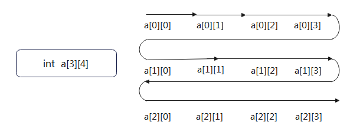
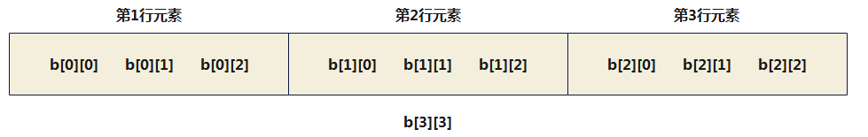
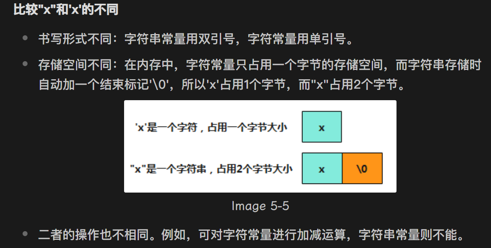
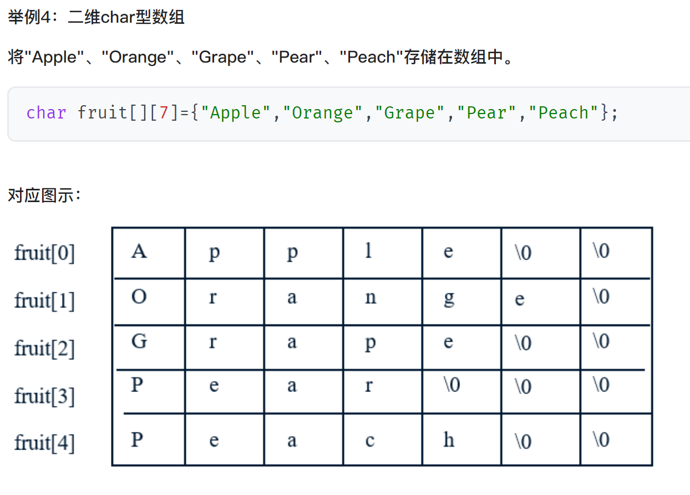
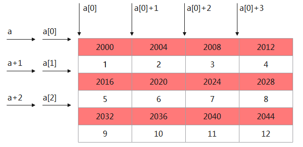

# 数组(Array)

## 一维数组

### 数组的定义和初始化

#### 数组的创建

数组是一组**相同类型元素**的**有序**集合，用于表示类型相同的一组数据。

创建数组的方式如下：

```c
数据类型 数组名[常量表达式];
int arr[5];
char arr1[10];
float arr2[1];
double arr3[20];
```

```c
#define NUM 10 //宏定义的常量
int arr1[NUM];
```

- `int`、`char`、`float` 和 `double` 是数组元素的类型。
- `arr` 是数组变量名。
- 声明数组时，必须给出数组的大小
- `[]` 中的整型常量表达式表示数组可以容纳的**成员数量**（即长度）。
- 在 C99 之前，`[]` 中不能使用变量，只能使用常量。C99 标准支持**变长数组**（VLA）, 允许使用**变量**作为数组长度

#### 数组的初始化

数组的初始化是指在创建数组的同时为其分配初始值, 可以部分初始化或完全初始化，未被初始化的元素将默认为`0`, 例如:

```c
int arr1[10] = {1, 2, 3}; // 部分初始化，剩余元素默认赋值为0
int arr2[5] = {1, 2, 3, 4, 5}; // 完全初始化
int arr3[] = {1, 2, 3, 4}; // 根据初始值确定数组长度
int arr4[3] = {'a', 98, 'c'}; // 使用字符的 ASCII 值初始化
int a[100] = {0};//将整个数组的每一个成员都设置为零
char arr5[] = "abc"; // 包含终止符 '\0' 的字符串初始化, 数组的空间大小为 4 个字节，其中存放的是 a b c \0
char arr6[] = {'a', 'b', 'c'}; // 不包含终止符的字符数组, 数组空间大小为 3 个字节, 存放的是 a b c
```


数组初始化时，可以**指定为哪些位置的成员**赋值: 

```c
int arr[15] = {[2] = 10, [5] = 20, [14] = 30};  //非角标2、5、14的位置自动赋值为0

//等同于
int arr[15] = {[5] = 20, [14] = 30, [2] = 10}; //指定位置的赋值可以不按角标从小到大的顺序
```

`变形形式1：`指定位置的赋值与顺序赋值，可以结合使用。

```c
int arr[15] = {1, [5] = 10, 11, [10] = 20, 21}; //角标0、5、6、10、11的位置被赋值
```

`变形形式2：`省略成员数量时，如果同时采用指定位置的赋值，那么数组长度将是最大的指定位置再加1。

```c
int arr[] = {[2] = 6, [9] = 12};  //此时数组的长度是10
```

注意：

- `int arr3[3] = {1, 2, 3, 4};` 初始化项太多，这是错误的。
- `int arr[0] = {0};` 数组大小不能为零，这是错误的。
- **数组变量一旦声明，数组名指向的地址就不可更改**。因为声明数组时，编译器会自动为数组分配内存地址，这个地址与数组名是绑定的，不可更改。

错误举例1：

```c
int nums[5];
nums = {22, 37, 3490, 18, 95}; // 使用大括号赋值时，必须在数组声明时赋值，否则编译时会报错。
```

错误举例2：

```c
int nums[5] = {1, 2, 3, 4, 5};
nums = {6, 7, 8, 9, 10}; // 报错
```

错误举例3：

```c
int ints[100];
ints = NULL; //报错
```

这也导致不能将一个数组名赋值给另外一个数组名。

```c
int a[5] = {1, 2, 3, 4, 5};
// 写法一
int b[5] = a; // 报错
// 写法二
int b[5];
b = a; // 报错
//上面两种写法都会更改数组 b 的地址，导致报错。
```

### 一维数组的使用


可以通过**下标引用操作符** `[]` 来访问数组中的元素，例如`arr[3]`访问下标为 3 的元素。

```c
int arr[10] = {1, 2, 3, 4, 5, 6, 7, 8, 9, 10};
printf("%d\n", arr[7]); // 打印第 8 个元素，值为 8

size_t length = sizeof(arr) / sizeof(arr[0]); // 计算数组元素个数

for (int i = 0; i < length; i++) printf("%d ", arr[i]); // 遍历数组并输出每个元素
printf("\n");

for (int i = 0; i < length; i++) printf("%d ", 10 - i); // 逆序输出
printf("\n");
```

1. 数组通过下标访问，下标从 `0` 开始。
2. 格式：`数组名[下标]`
3. 数组的下标从0开始，用`int arr[10];`定义数组，则`最大下标值为9`，不存在数组元素`arr[10]`。
4. 数组的大小可以通过 `sizeof` 计算得到。

> - `sizeof` 用于计算数组元素个数：
>   `sizeof(arr)` 计算整个数组的大小，`sizeof(arr[0])` 计算数组首元素的大小。数组元素个数 `length` 即为 `sizeof(arr) / sizeof(int)`。
>
> - `sizeof` 返回值的数据类型是 `size_t` ，所以 `sizeof(arr) /sizeof(arr[0])` 的数据类型也是`size_t` 。在 printf() 里面的占位符，要用 `%zd` 或 `%zu` 

### 一维数组在内存中的存储

```c
int arr[10] = { 0 };
int i = 0;
//计算数组中的元素个数
int sz = sizeof(arr) / sizeof(arr[0]);
//打印数组元素的地址
for (i = 0; i < sz; ++i)
{
    printf("&arr[%d] = %p\n", i, &arr[i]);
}
```

结果：


结论：

1. 随着一维数组下标的增长，元素的地址由小到大变化。
2. 每两个相邻元素之间的地址差为 `4` 个字节（一个整型占 4 个字节）。
3. **数组在内存中是连续存放的**，这种连续存储为使用指针访问数组奠定了基础。
4. 数组中的地址是由**低到高**排序的。


## 二维数组

### 二维数组的创建和初始化

如果我们把一维数组作为数组的元素，这就是二维数组。二维数组作为数组元素的数组被称为三维数组，二维数组以上的数组统称为多维数组。

#### 二维数组的创建

```c
数据类型 数组名[行数][列数];
int arr[3][4];
char arr1[2][5];
float arr2[3][3];
double arr3[4][2];
```

对于二维数组 `int array[M][N]`，说明如下：

1. M 和 N 都必须为常数。
2. M 代表数组有 M 行，N 代表每行中有 N 个元素。
3. 其中行 (M) 可以省略，省略后必须给出初始化表达式，编译器从初始化结果中推断数组有多少行。
4. 列一定不能省略，因为列省略了就不能确定一行有多少个元素，也不能确定数组有多少行。
5. C 语言规定，二维数组的行是从 0 开始的，列也是从 0 开始的。

#### 二维数组的初始化

```c
int arr1[3][5] = {1, 2, 3, 4, 5, 2, 3, 4, 5, 6, 3, 4, 5, 6, 7}; // 完全初始化
int arr2[3][5] = {{1, 2, 3, 4, 5}, {1, 2, 3, 4, 5}, {1, 2, 3, 4, 5}}; // 完全初始化
int arr3[3][5] = {0}; // 不完全初始化
int arr4[3][5] = {{1, 2}, {3, 4}, {5, 6}}; // 按行初始化
int arr5[][5] = {{1, 2, 3}, {5, 5}, {6, 7, 8, 9}}; // 初始化时省略行，但不能省略列
```

注意：

- `int arr6[][] = {0};` 错误，二维数组如果有初始化，行可以省略，列不能省略。
- `int arr7[0][5] = {0};` 错误，数组的大小必须大于零。

二维数组初始化时省略行, 但是不能省略列

```c
int arr8[][5] = {1,2,3};
int arr9[][5] = {1,2,3,4,5,6,7};
int arr10[][5] = {{1,2},{3,4},{5,6}};
```


### 二维数组的使用

二维数组的使用也是通过下标的方式, 可以通过`循环嵌套`访问二维数组中的元素。

```c
int arr[3][5] = { {1,2,3},{5,5},{6,7,8,9} };
int i = 0;
int j = 0;
for (i = 0; i < 3; i++)
{
    for (j = 0; j < 5; j++)
        printf("%d ", arr[i][j]);
    printf("\n");
}
```

### 二维数组在内存中的存储

用`矩阵形式`（如3行4列形式）表示二维数组，是`逻辑`上的概念，能形象地表示出行列关系。而在`内存`中，各元素是连续存放的，不是二维的，是`线性`的。

C语言中，二维数组中元素排列的顺序是`按行存放`的。即：先顺序存放第一行的元素，再存放第二行的元素。（最右边的下标变化最快，第一维的下标变化最慢）。



举例，整型数组`b[3][3]`在内存中的存放：



从输出结果可以看出，每行内部的每个元素都是相邻的，地址之间相差 4 个字节（因为`int`类型占 4 个字节）。跨行位置的两个元素（如 `arr[0][4]` 和 `arr[1][0]`）之间也是相差 4 个字节。因此，**二维数组中的每个元素都是连续存放的**。

可以理解为：二维数组有三个元素，每个元素是一个一维数组。二维数组其实是一维数组的数组。


> 我们可以把二维数组想象成一个几行几列的数组, 但本质上的二维数组是一列的。 

总结: 

1. 二维数组中的每个元素在内存中是连续存放的。
2. 每行内部的元素地址是相邻的，地址差为元素类型的大小（如 `int` 为 4 个字节）。
3. 跨行的相邻元素地址差也是元素类型的大小。
4. 可以将二维数组看作是由多个一维数组组成的一维数组。

## 数组越界

- 数组的下标有范围限制，规定从 0 开始，如果数组有 n 个元素，最后一个元素的下标是 n-1。
- 当数组的下标小于 0 或大于 n-1 时，就是**数组越界访问**，超出了数组合法空间。
- C 语言本身不做数组下标的越界检查，编译器也不一定报错，但这并不意味着程序是正确的。因此，编写代码时应自行做越界检查。

代码举例：

```cs
	int arr[5] = { 1,2,3,4,5 };	
	int i = 0;	
	for (i = 0; i <= 5; i++){  //其中的arr[5]越界访问了	
  	printf("%d ", arr[i]);	
	}	
```


 从上图可知，越界访问的值是系统给的**随机值**

 注意: 二维数组的行和列也可能存在越界

## 字符数组

在 C 语言中，字符数组是一种用于**存储字符串**的常用数据结构。字符数组的每个元素都存储一个字符，并且数组的最后一个字符是一个空字符 `\0`，用于标识字符串的结束。字符数组的定义和使用方法与其他数据类型的数组类似，但其独特之处在于它专门用于处理字符串数据。通过字符数组，我们可以轻松地创建、操作和管理字符串。

### 字符数组的创建和初始化

在 C 语言中没有专门的字符串变量或 string 数据类型, 通常使用**字符数组存储字符串**。字符数组实际上是一系列字符的集合，可以理解为字符串。

#### 字符串的存储


```c
char c[10] = "c program";//定义了一个字符数组并初始化为字符串
```

该数组在计算机中存储的形式为

| c [0] | c [1] | c [2] | c [3] | c [4] | c [5] | c [6] | c [7] | c [8] | c [9] |
| :--: | :--: | :--: | :--: | :--: | :--: | :--: | :--: | :--: | :--: |
|  c   | `   ` | p    | r    | o    | g    | r    | a    | m    |  `\0`  |

**注意：** 字符串实际占有的单元数量等于字符串长度加 1。定义时应考虑元素总个数比实际长度多 1。

#### 字符数组的初始化

字符数组的初始化可以通过字符常量或字符串常量进行。

```c
char c[10] = {'c', ' ', 'p', 'r', 'o', 'g', 'r', 'a', 'm', '\0'};
char c[5]={'H','e','l','l','o'};
char c[]={'H','e','l','l','o'};// 不指定长度
char c[]={"Hello"};通常使用字符数组存储字符串,所以可以使用字符串给字符数组赋值
char c[]="Hello";
```

**说明：**

1. 如果初始化时提供的字符个数超过数组长度，会导致编译错误。
2. 如果初始化时提供的字符个数与数组长度相同，可以省略数组长度，编译器会自动根据初值个数确定数组长度。
3. 如果提供的字符个数少于数组长度，未赋值的元素将自动初始化为**空字符**（`'\0'`）。

#### 用字符串常量对字符数组初始化

```c
char str1[6] = "CHINA";         // 包含终止符 '\0'
char str2[] = "CHINA";          // 省略长度值，自动确定数组长度
char str3[12] = "HOW ARE YOU";  // 包含终止符 '\0'
char str4[] = {'H', 'O', 'W', ' ', 'A', 'R', 'E', ' ', 'Y', 'O', 'U', '\0'}; // 等价
char *p = str1;  // 用一个指针指向该数组，*(p+i) 等价于 str1 [i]
```

**说明：**

1. 将字符串存储到字符数组中时，字符串以空字符 `'\0'` 结尾，这个空字符标志着字符串的结束。有效的字符串由字符序列和终止符 `'\0'` 组成。对字符串的任何操作实际上都是对字符数组的操作。
2. 普通数组中的元素是确定的，通常使用下标来控制循环；而字符串数组使用结束符 `'\0'` 来判断字符串的结束，从而控制循环。这种方式避免了数组越界和可能的内存访问错误

  ```c
  char strArray[] = "Hello, World!"; // 字符串数组
  int i = 0;
  // 字符串数组通过使用 '\0' 结束符来判断字符串的结束,从而遍历数组
  while (strArray[i] != '\0') {
    printf("%c", strArray[i]);
    i++;
  }
  ```

### 字符数组的结束标志

在 C 语言中，使用字符数组存储字符串时，系统会自动在字符数组末尾添加一个结束符 `'\0'` 作为结束标志。例如：

```c
char cArray[] = "Hello";
```

字符串总是以结束符 `'\0'` 作为结束标志，因此在将一个字符串存储入一个字符数组时，也会将结束符 `'\0'` 存储入该字符数组，并以此作为该字符数组的结束标志。

> **结束符的作用**
>
> 1. **标识字符串结束**：结束符 `'\0'` 标识字符串的结束，使得函数如 `strlen`、`strcpy` 等可以正确处理字符串。
> 2. **避免内存访问错误**：结束符 `'\0'` 可以防止在处理字符串时访问超出数组边界的内存

**字符数组长度的考虑**

虽然有了结束符 `'\0'` 后，字符数组的长度就不那么重要了，但在定义字符数组时仍应确保数组长度足够容纳字符串及其结束符。如果字符数组中存储了多个不同长度的字符串，数组长度应大于最长字符串的长度。

**赋值方式的区别 :**

**用字符串方式赋值比逐个字符赋值多占 1 字节**，这个字节用于存储结束符 `\0`。编译器会自动在字符串末尾添加这个结束符。因此，以下初始化语句是等价的：

```c
char cArray[] = "Hello";
char cArray[] = {'H', 'e', 'l', 'l', 'o', '\0'};
```

**非结束符字符数组**

字符数组并不强制要求最后一个字符为 `'\0'`，甚至可以不包含 `'\0'`。例如，以下写法也是合法的：

```c
char cArray[5] = {'H', 'e', 'l', 'l', 'o'};
```

然而，为了便于测定字符串的实际长度以及在程序中进行相应的处理，通常在字符数组中人为地加上一个结束符 `'\0'`

**区分：'\0'、0、'0'**

字符 '\0' 不同于字符 '0' ，前者的ASCII 码是0（二进制形式 00000000 ），后者的 ASCII 码是48（二进制形式 00110000 ）。

```c
printf("%d\n", '\0' == 0);		//1
printf("%d\n", '\0' == '0');	//0
```





**总结 : **

1. 字符数组用于存储字符串，每个字符占用一个数组元素。
2. 字符数组的初始化可以使用字符常量或字符串常量。
3. 字符串总是以 `'\0'` 作为结束标志，多占用一个字节。
4. 定义字符数组时应考虑字符串的实际长度，保证数组长度大于字符串的实际长度。
5. 字符数组可以通过指针来访问，通过指针偏移来访问数组中的其他元素。
6. **字符数组的元素个数**包括`\0`, 但是**字符串长度**`(strlen)`不包括`\0`

## 变长数组（VLA）

数组声明的时候，数组长度除了使用常量，也可以使用变量或表达式来指定数组的大小。这叫做`变长数组`（variable-length array，简称 VLA）。

### 变长数组的基本用法

在 C99 标准之前，数组的大小只能使用常量或常量表达式来指定，或者在初始化数组时省略大小。这种限制导致数组大小不够灵活，可能会导致数组过大浪费空间，或者过小无法满足需求。

C99 标准引入了变长数组的新特性，允许使用变量来指定数组的大小。以下是一个简单的示例：

```c
int n = x + y;
int arr[n];
```

在上面的示例中，数组 `arr` 的长度取决于变量 `n` 的值，编译器无法在编译时确定数组的长度，只有在运行时才能知道 `n` 的具体值。因此，`arr` 是一个变长数组。

### 变长数组的特征

变长数组的根本特征是其长度只有在`运行时才能确定`，因此变长数组不能在声明时进行初始化。优点是无需为数组估计长度，可以根据实际需要动态分配长度。

需要注意的是，变长数组的大小一旦在运行时确定，就不能再改变。变长数组的意思是`数组的大小可以使用变量来指定`，但一旦指定后，数组的大小就固定了。

### 变长数组的示例

以下是一个使用变长数组的完整示例，展示了如何在运行时根据用户输入确定数组的大小，并进行读写操作：

```c
int n = 0;
printf("请输入数组的大小: ");
scanf("%d", &n); // 根据用户输入确定数组大小

int arr[n]; // 使用变长数组
printf("请输入 %d 个整数:\n", n);

for (int i = 0; i < n; i++) {
  scanf("%d", &arr[i]);
}

printf("数组的内容是: ");
for (int i = 0; i < n; i++) {
  printf("%d ", arr[i]);
}
printf("\n");
```

在上述代码中，用户输入数组的大小 `n`，程序根据输入的 `n` 值动态分配数组 `arr` 的大小，并读取 `n` 个整数存入数组中，最后输出数组的内容。

> **方式2：**如果你的编译器版本不支持变长数组，还可以考虑使用动态内存分配（使用`malloc()函数` ）来创建动态大小的数组。(通用的方式)
>
> 分配：
>
> ```c
> //使用malloc()函数, 动态的分配内存, 创建一个指定长度的数组
> int length = 5;
> int *arr = (int *)malloc(length * sizeof(int));//在堆空间开辟的数组空间
> ```
>
> 释放：
>
> ```c
> //在使用完动态创建的数组后, 一定要回收此数组的内存空间, 否则就存在内存泄漏
> free(arr);
> ```

数组作为函数参数
------------

### 数组的地址

数组是一组连续存储的同类型值，通过起始地址（即第一个元素的地址）可以推算出其他元素的地址。请看下面的例子：

```c
int a[5] = {11, 22, 33, 44, 55};
int* p = &a[0];

printf("%d\n", *p);  // 输出 "11"
```

在上面的示例中，`&a[0]` 是数组 `a` 的第一个元素 `11` 的 **内存地址**，也是 **整个数组的起始地址**。通过这个地址（`*p`），可以获得第一个元素的值 `11`。

由于数组的起始地址是常用操作，`&arr[0]` 的写法略显繁琐，C 语言提供了简便写法：

**数组名本身就代表起始地址，即数组名是指向第一个元素（`arr[0]`）的指针**

```c
int arr[5] = {11, 22, 33, 44, 55};
int* p = &arr[0];
// 等同于
int* p = arr;
```

上面示例中，`&arr[0]` 和数组名 `arr` 是等价的。

这样一来，将数组名传入函数时，相当于传入一个指针。在函数内部可以通过这个指针访问整个数组。

函数接受数组作为参数时，函数原型可以写成以下两种形式：

```c
// 写法一
int sum(int arr[], int len);
// 写法二
int sum(int* arr, int len);
```

在上面的示例中，传入一个整数数组与传入一个整数指针是同一回事，数组符号 `[]` 与指针符号 `*` 是可以互换的。下面的例子展示了通过数组指针对元素进行求和：

```c
int sum(int* arr, int len) {
  int i;
  int total = 0;

  // 假定数组有 10 个成员
  for (i = 0; i < len; i++) {
    total += arr[i];
  }
  return total;
}
```

上面示例中，传入函数的是一个 **指针 `arr`**（也是 **数组名**）和 **数组长度**，通过 **指针获取数组的每个元素**，从而求和。

`*` 和 `&` 运算符也可以用于多维数组。

```c
int a[4][2];

// 取出 a [0][0] 的值
*(a[0]);
// 等同于
**a
```

上面示例中，`a[0]` 是一个指针，指向第二维数组的第一个元素 `a[0][0]`。所以，`*(a[0])` 取出的是 `a[0][0]` 的值。至于 `**a`，就是对 `a` 进行两次 `*` 运算，第一次取出的是 `a[0]`，第二次取出的是 `a[0][0]`。同理，二维数组的 `&a[0][0]` 等同于 `*a`。

### 数组名是什么？

> 数组名就是地址，**数组名表示数组首元素的地址**。也就是说，数组名是一个指向数组第一个元素的指针。

```c
int arr[10] = {1, 2, 3, 4, 5};

printf("%p\n", arr);     // 输出数组首元素的地址
printf("%p\n", arr + 1); // 输出第二个元素的地址
printf("%p\n", &arr[0]); // 输出数组首元素的地址
printf("%d\n", *arr);    // 输出数组首元素的值
```


可以看出：**数组名是首元素的地址**

有两种情况例外，数组名不表示首元素的地址：

> 1. `sizeof(数组名)`：计算整个数组的大小，`sizeof` 内部单独放一个数组名时，数组名表示整个数组。
> 2. `&数组名`：取出的是数组的地址，表示整个数组。

除此 1, 2 两种情况之外，数组名都表示数组首元素的地址。

代码演示： 

```c
#include <stdio.h>
int main() {
  int arr[10] = {1, 2, 3, 4, 5};
  printf("%p\n", arr);      // 输出数组首元素的地址
  printf("%p\n", &arr);     // 输出整个数组的地址
  printf("----------\n");
  printf("%p\n", arr + 1);  // 输出第二个元素的地址
  printf("%p\n", &arr + 1); // 输出数组后一个地址，跳过整个数组的大小
  return 0;
}
```


 从结果中可以看到：

- `arr + 1`：数组首元素地址加 1，跳过一个元素的大小（4 字节）。
- `&arr + 1`：整个数组地址加 1，跳过整个数组的大小（40 字节）。

### 作为函数的参数

**数组作为函数参数**

**当数组作为参数传递给函数时，传递的是数组首元素的地址，而不是整个数组。函数接收到的是一个指针，可以通过指针访问数组元素。**

#### 声明参数数组

数组作为函数的参数，一般会同时传入**数组名**和**数组长度**。

```c
int sum_array(int a[], int n) {
    int sum = 0;
    for (int i = 0; i < n; i++) {
        sum += a[i];
    }
    return sum;
}

int main() {
    int a[] = {3, 5, 7, 3};
    int sum = sum_array(a, 4);
    printf("Sum: %d\n", sum);
    return 0;
}
```

在上面的示例中，函数 `sum_array()` 的第一个参数是数组名，第二个参数是数组长度。由于数组名实际上是一个指针，如果只传数组名，函数只知道数组开始的地址，不知道结束的地址，所以需要把数组长度也一起传入。

#### 多维数组作为参数

如果函数的参数是多维数组，除了第一维的长度可以当作参数传入函数，其他维的长度需要写入函数的定义。

```c
int sum_array(int a[][4], int n) {
    int sum = 0;
    for (int i = 0; i < n; i++) {
        for (int j = 0; j < 4; j++) {
            sum += a[i][j];
        }
    }
    return sum;
}

int main() {
    int a[2][4] = {
        {1, 2, 3, 4},
        {8, 9, 10, 11}
    };
    int sum = sum_array(a, 2);
    printf("Sum: %d\n", sum);
    return 0;
}
```

在这个示例中，函数 `sum_array()` 接受一个二维数组作为参数。第一个参数表示数组本身（`a[][4]`），不需要指定第一维的长度，因为该长度会作为第二个参数传入函数，但必须指定第二维的长度为 `4`。这是因为函数内部只获取到数组的起始地址 `a` 和第一维的成员数量 `2`。为了准确计算数组的结束地址，必须了解第一维每个成员的字节长度。

#### 变长数组作为参数

变长数组作为函数参数时，写法略有不同。

```c
int sum_array(int n, int a[n]) {
    // ...
}

int main() {
    int a[] = {3, 5, 7, 3};
    int sum = sum_array(4, a);
    return 0;
}
```

在上面的示例中，数组 `a[n]` 是一个变长数组，它的长度取决于变量 `n` 的值，只有运行时才能知道。所以，变量 `n` 作为参数时，顺序一定要在变长数组前面，这样运行时才能确定数组 `a[n]` 的长度，否则就会报错。变长数组的函数原型可以省略参数名，使用 `*` 代替变量名也是合法的

```c
int sum_array(int, int [*]);
int sum_array(int, int []);
```

#### 多维变长数组作为参数

变长数组作为函数参数有一个好处，就是多维数组的参数声明可以省略后面的维度。

```c
// 原来的写法
int sum_array(int a[][4], int n);

// 变长数组的写法
int sum_array(int n, int m, int a[n][m]);
```

在这个示例中，函数 `sum_array()` 的参数是一个多维数组。按照原来的写法，一定要声明第二维的长度。但是使用变长数组的写法，就不用声明第二维长度了，因为它可以作为参数传入函数。

#### 数组字面量作为参数

C 语言允许将数组字面量作为参数，传入函数。

```c
// 数组变量作为参数
int a[] = {2, 3, 4, 5};
int sum = sum_array(a, 4);

// 数组字面量作为参数
int sum = sum_array((int []){2, 3, 4, 5}, 4);
```

在上面的示例中，两种写法是等价的。第二种写法省掉了数组变量的声明，直接将数组字面量传入函数。`{2, 3, 4, 5}` 是数组值的字面量，`(int [])` 类似于**强制类型转换**，告诉编译器怎么理解这组值。

### 小结

1. **数组名**：通常表示数组首元素的地址，但在 `sizeof` 和 `&` 操作符下表示整个数组。
2. **数组作为函数参数**：传递的是数组首元素的地址，函数通过指针访问数组元素。
3. **声明参数数组**：通常需要传递数组名和数组长度。
4. **多维数组作为参数**：需要指定除第一维以外的其他维度。
5. **变长数组作为参数**：变长数组可以简化多维数组的参数声明。
6. **数组字面量作为参数**：可以直接将数组字面量传入函数。

## 数组指针的加减法



数组名可以进行加法和减法运算，相当于在数组元素之间前后移动，**即从一个元素的内存地址移动到另一个元素的内存地址**。例如，`a + 1` 返回下一个元素的地址，`a - 1` 返回上一个元素的地址。

```c
int a[5] = {11, 22, 33, 44, 55};
for (int i = 0; i < 5; i++) {
  printf("%d\n", *(a + i));
}
```

在上面的示例中，通过指针的移动遍历数组，`a + i` 在每轮循环中指向下一个元素的地址，`*(a + i)` 取出该地址的值，等同于 `a[i]`。对于数组的第一个元素，`*(a + 0)`（即 `*a`）等同于 `a[0]`。

由于数组名与指针是等价的，以下等式总是成立。

```c
a[b] == *(a + b)
```

上面的代码展示了数组元素的两种访问方式，一种是使用方括号 `a[b]`，另一种是使用指针 `*(a + b)`。

如果指针变量 `p` 指向数组的一个元素，那么 `p++` 就相当于指向下一个元素，这种方法常用来遍历数组。

```c
int a[] = {11, 22, 33, 44, 55, 999};

int* p = a;

while (*p != 999) {
  printf("%d\n", *p);
  p++;
}
```

在上面的示例中，通过 `p++` 让变量 `p` 指向下一个元素。

注意：数组名指向的地址是不可变的，因此在上例中，不能直接对 `a` 进行自增，即 `a++` 的写法是错误的，必须将 `a` 的地址赋值给指针变量 `p`，然后对 `p` 进行自增。

通常遍历数组是通过比较数组长度来实现，但也可以通过比较数组起始地址和结束地址来遍历数组：

```c
int sum(int* start, int* end) {
  int total = 0;

  while (start < end) {
    total += *start;
    start++;
  }

  return total;
}

int arr[5] = {20, 10, 5, 39, 4};
printf("%i\n", sum(arr, arr + 5));
```

在上面的示例中，`arr` 是数组的起始地址，`arr + 5` 是结束地址。只要起始地址小于结束地址，就表示尚未到达数组尾部。

反过来，通过数组的减法，可以知道两个地址之间有多少个数组成员，例如下面的例子，计算数组长度的函数。

```c
int arr[5] = {20, 10, 5, 39, 88};
int* p = arr;

while (*p != 88)
  p++;

printf("%i\n", p - arr); // 4
```

在上面的示例中，将某个数组成员的地址减去数组起始地址，就可以得知当前成员与起始地址之间有多少个成员。

对于多维数组，不同维度的指针加减法含义不同：

```c
int arr[4][2];
arr + 1;        // 指针指向 arr [1]
arr[0] + 1;     // 指针指向 arr [0][1]
```

上面示例中，`arr` 是一个二维数组，`arr + 1` 是将指针移动到第一维数组的下一个元素，即 `arr[1]`。由于每个第一维的元素本身都包含另一个数组，即 `arr[0]` 是一个指向第二维数组的指针，所以 `arr[0] + 1` 的含义是将指针移动到第二维数组的下一个元素，即 `arr[0][1]`。

同一个数组的两个成员的指针相减时，返回它们之间的距离: 

```c
int* p = &a[5];
int* q = &a[1];

printf("%d\n", p - q); // 4
printf("%d\n", q - p); // -4
```

上面的示例中，变量 `p` 和 `q` 分别是数组第 5 个位置和第 1 个位置的指针，它们相减等于 4 或-4。

## 一维数组的应用

### 数值型数组特征值统计

这里的特征值涉及到：平均值、最大值、最小值、总和等

举例1：定义一个int型的一维数组，包含10个元素，然后求出数组中的最大值，最小值，总和，平均值，并输出出来。

```c
int main() {
	int arr[] = {23, 45, 5, 63, 64, 88, 22, 77, 33, 56};
	size_t len = sizeof(arr) / sizeof(arr[0]);
	int max = arr[0];
	int min = arr[0];
	int sum = 0;
	
	for(int i = 0; i < len; i++){
		if(max < arr[i])
			max = arr[i];
		if(min > arr[i])
			min = arr[i];
		sum += arr[i];
	}
	
	
	printf("最大值为%d\n", max);
	printf("最小值为%d\n", min);
	printf("数组的总和为%d\n", sum);
	printf("数组元素的平均值为%.2lf", (sum + 0.0) / len);
	return 0;
}
```

举例2：评委打分

分析以下需求，并用代码实现：

（1）在编程竞赛中，有10位评委为参赛的选手打分，分数分别为：5，4，6，8，9，0，1，2，7，3

（2）求选手的最后得分（去掉一个最高分和一个最低分后其余8位评委打分的平均值）

```c
int main() {
    int scores[10] = {5,4,6,8,9,0,1,2,7,3};

    int max = scores[0]; //记录最高分
    int min = scores[0]; //记录最低分
    int sum = 0; //记录总分
    int arrLen = sizeof(scores) / sizeof(int); //记录数组长度
    for(int i = 0;i < arrLen;i++){
        if(max < scores[i]){
            max = scores[i];
        }

        if(min > scores[i]){
            min = scores[i];
        }

        sum += scores[i];
    }
    //计算平均分
    double avg = (double)(sum - max - min) / (arrLen - 2);

    printf("选手去掉最高分和最低分之后的平均分为：%.2lf\n" , avg);

    return 0;
}
```

### 数组的复制

由于数组名是指针，所以复制数组不能简单地复制数组名。

```c
int a[3] = {10,20,30};
int* b;
b = a;
```

上面的写法，结果不是将数组 a 复制给数组 b ，而是让 a 和 b 指向同一个数组。

**正确方式1：使用循环**

这是复制数组最简单的方法，将数组元素逐个进行复制。比如，将数组 a 的成员逐个复制给数组 b。

```c
#include <stdio.h>

#define LENGTH 3

int main() {
    int a[LENGTH] = {10, 20, 30};
    int b[LENGTH];

    // 复制数组 a 到数组 b
    for (int i = 0; i < LENGTH; i++) {
        b[i] = a[i];
    }

    // 打印数组 b 的内容
    printf("复制后的数组 b：");
    for (int i = 0; i < LENGTH; i++) {
        printf("%d ", b[i]);
    }
    printf("\n");

    return 0;
}
```

**正确方式2：使用 memcpy() 函数**

 memcpy() 函数定义在头文件 string.h 中，直接把数组所在的那一段内存，再复制一份。3个参数依次为：`目标数组`、`源数组`以及`要复制的字节数`。

```c
#include <stdio.h>
#include <string.h>

#define LENGTH 3

int main() {
    int a[LENGTH] = {10, 20, 30};
    int b[LENGTH];

    // 使用 memcpy 函数复制数组 a 到数组 b
    memcpy(b, a, LENGTH * sizeof(int));

    // 打印数组 b 的内容
    printf("复制后的数组 b：");
    for (int i = 0; i < LENGTH; i++) {
        printf("%d ", b[i]);
    }
    printf("\n");

    return 0;
}
```

**两种方式对比：**

下面是对两种方式进行比较的一些要点：

1. **循环复制：**
   - 优点：`简单直观`，容易理解和实现。不需要引入额外的头文件。
   - 缺点：需要编写循环代码来遍历数组并逐个赋值，相对而言可能`稍显繁琐`。不适用于复制大型数组或复杂数据结构。
2. **`memcpy()`函数复制：**
   - 优点：使用标准库提供的函数，可以实现`快速且高效`的内存复制。适用于`大型数组或复杂数据`结构的复制。可以直接复制字节数，不需要遍历数组。
   - 缺点：需要包含 `<string.h>` 头文件。对于简单的数组复制，可能有些`过于繁重`。

### 4.3 数组元素的反转

**实现思想：**数组对称位置的元素互换。

方式1：


代码实现

```c
int main() {
    int arr[] = {1,2,3,4,5,6,7,8,9};
    int size = sizeof(arr) / sizeof(arr[0]); //数组的长度

    printf("原始数组：");
    for (int i = 0; i < size; i++) {
        printf("%d ", arr[i]);
    }
    printf("\n");

    for(int i = 0;i < size / 2;i++){
        int temp = arr[i];
        arr[i] = arr[size - 1 - i];
        arr[size - 1 - i] = temp;
    }

    printf("反转后的数组：");
    for (int i = 0; i < size; i++) {
        printf("%d ", arr[i]);
    }
    printf("\n");

    return 0;
}
```

方式2：


```c
int main() {
    int arr[] = {1, 2, 3, 4, 5,6,7,8,9};
    int size = sizeof(arr) / sizeof(arr[0]); //数组的长度

    printf("原始数组：");
    for (int i = 0; i < size; i++) {
        printf("%d ", arr[i]);
    }
    printf("\n");

    int left = 0; // 起始指针
    int right = size - 1; // 结尾指针

    while (left < right) {
        // 交换起始指针和结尾指针指向的元素
        int temp = arr[left];
        arr[left] = arr[right];
        arr[right] = temp;

        // 更新指针位置
        left++;
        right--;
    }

    printf("反转后的数组：");
    for (int i = 0; i < size; i++) {
        printf("%d ", arr[i]);
    }
    printf("\n");

    return 0;
}
```

## 字符串处理函数

### 字符串复制：`strcpy()`

`strcpy()` 函数用于将一个字符串复制到另一个字符串中，包括字符串的结束符 `\0`。它的使用非常普遍，比如在用户更改密码时，往往需要复制新密码字符串到存储密码的字符数组中。

```c
strcpy( 目的字符数组名,源字符数组名 )
```

功能: 将源字符数组中的字符串复制到目的字符数组中。字符串结束符“\0”也会一
同复制。

> - 目的字符数组应该有足够的长度, 否则不能完整存储所复制的字符串。
> - 目标字符数组名必须是数组名；源字符数组名可以是数组名或字符串常量（相当于将字符串赋给字符数组）。
> - 不能直接用赋值语句将字符串常量或字符数组赋给字符数组。

### 字符串连接 - `strcat()`

`strcat()` 函数将源字符串连接到目标字符串的末尾，形成一个新的字符串。这个过程会删除目标字符串原有的结束符 `\0`。

```c
strcat( 目的字符数组名 , 源字符数组名 )
```

功能: 将源字符数组中的字符串连接到目标字符数组中的字符串末尾，并删除目标字符数组中原有的字符串结束符“\0”。

> - 目标字符数组必须有足够的长度，以存储连接后的字符串。
> - 字符串复制覆盖目标字符数组中的内容，而字符串连接则是将源字符串追加到目标字符串末尾。

### 字符串比较 - `strcmp()`

`strcmp()` 函数用于将两个字符串从首字母开始按顺序比较各个字符的 ASCII 码值。

```c
strcmp( 字符数组名 1, 字符数组名 2)
```

功能：比较两个字符数组中的字符串，从首字母开始按顺序对各字符的 ASCII 码值进行比较，并返回比较结果。

返回值如下:

- 字符串 1 等于字符串 2，返回 0。
- 字符串 1 大于字符串 2，返回正数。
- 字符串 1 小于字符串 2，返回负数。

> 注意事项：
>
> - 比较时如果出现不同字符，则以第一个不同字符的比较结果为准。
> - 不能用关系运算符或赋值运算符进行字符串比较，例如：
>
> ```c
> if (str[2] == "traceback") ... // 错误
> str[2] = "traceback"; ... // 错误
> ```

### 字符串大小写转换

在处理大小写不敏感的情况下，我们需要进行字符串的大小写转换。在处理验证码时，通常需要进行字符串的大小写转换，例如注册账号时输入“yynd”和“YYND”都应被接受。在 C 语言中，使用 `strupr()` 函数和 `strlwr()` 函数进行转换。

`strupr()` 函数的语法格式如下：

```c
strupr(字符数组名)
```

功能: 将字符数组中的字符串中的小写字母转换为大写字母, 其他字母不变。
`strlwr()` 函数的语法格式如下:

```c
strlwr(字符数组)
```

功能: 将字符数组中的字符串中的大写字母转换为小写字母, 其他字母不变。

### 获取字符串长度：`strlen()`

在需要动态获取字符串长度的场合，例如注册账号时要求密码长度在 6 至 16 个字符之间，可以使用 `strlen()` 函数获取字符串长度。

```c
strlen(字符数组)
```

功能：计算字符数组中字符串的实际长度（不含字符串结束符 `\0`），返回值为字符串的实际长度。

在 C 语言中，虽然可以使用循环语句判断字符串结束符“\0”来获取字符串的长度，但这种方法比较繁琐，可以使用 `strlen()` 函数获取字符串的长度。
