# 指针

## 指针的理解与定义

### 变量的访问方式

在计算机中，程序的运行和变量的存储都是在内存中进行的。不同类型的变量占用不同大小的内存空间。访问内存中变量存储的数据有两种方式：`直接访问`和`间接访问`。
**直接访问: **直接使用变量名来访问变量的值。

```c
int num1 = 10;
int num2 = 20;
int num3 = num1 + num2;
```

**间接访问**：通过指针来访问变量的值。指针是一种特殊的变量，其存储的是另一个变量的地址，而非数据本身。通过指针，我们可以访问和操作该地址中的数据。

### 内存地址与指针

为了能够有效的访问到内存的每个单元(即一个字节)，就给内存单元进行了编号，这些编号被称为该**内存单元的地址**。每个内存单元都有地址，所以变量存储的数据也是有地址的。

```c
int num = 5;//假设变量 num 存储在内存地址 0x0012FF44 处，我们可以通过这个地址访问变量 num 的值。
```


通过地址能找到所需的变量单元，可以说，**地址指向该变量单元**，将**地址形象化地称为“指针”**。即：

- **变量**：命名的内存空间，用于存放各种类型的数据。
- **变量名**：变量名是给内存空间取的一个容易记忆的名字。
- **变量值**：在变量单元中存放的数据值。
- **变量的地址**：变量所使用的内存空间的地址，即**指针**。


- `指针变量`：一个变量专门用来存放另一变量在内存中的地址（即指针）。通过访问指针变量，我们可以间接访问该地址处的变量数据。(有时为了阐述方便，将指针变量直接说成指针。)


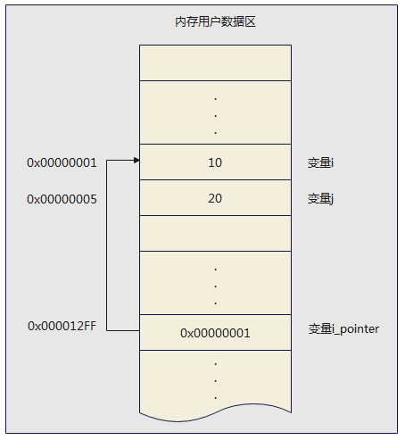

在上图中，地址 `0x00000001` 是变量 `i` 的指针，`i_pointer` 就是一个指针变量。

> **体会**：指针就是内存地址，使用指针访问变量，就是直接对内存地址中的数据进行操作。

### 指针变量的定义

**一般格式：**

```c
数据类型 *指针变量名 [=初始地址值];
```

- **数据类型**：指针变量所指向的变量的数据类型。可以是 `int`、`char`、`float` 等基本类型，也可以是数组等构造类型。
- **`*` 字符**：用于告知系统这里定义的是一个指针变量，通常跟在类型关键字的后面。例如，`char *` 表示一个指向字符的指针，`float *` 表示一个指向浮点数的指针。此外，还有指向数组的指针、指向结构体的指针。

**示例1：**定义一个指向 `int` 类型的指针

```c
int *p;  // 读作：指向 int 的指针”或简称“int 指针”
```

这是一个指针变量，用于存储 int 型的整数在内存空间中数据的地址。

变形写法：

```c
int* p;
int * p;
```

> **注意**：
>
> 1. 指针变量的名字是 `p`，不是 `*p`。
> 2. 指针变量中只能存放地址，不要将一个整数（或任何其它非地址类型的数据）赋给一个指针变量。

示例2：同一行声明两个指针变量

```c
int *a, *b; // 正确。a 和 b 都是指向 int 的指针。
int* a, b;  // 错误。a 是指向 int 的指针，b 是 int 类型。
```

示例3：指向指针的指针（多级指针），这时就要用两个星号 ** 表示

```c
int **foo; // foo 是一个指向指针的指针，即二级指针。
```

### 指针的应用场景

场景1：使用指针访问变量或数组的元素。

```c
int num = 10;
int *p = &num;  // 指针 p 指向变量 num 的地址

printf("num 的值：%d\n", num);    // 直接访问变量
printf("通过指针访问 num 的值：%d\n", *p);  // 通过指针间接访问变量
```

场景2：应用在数据结构中。

指针在数据结构中有广泛的应用，例如链表、树和图。

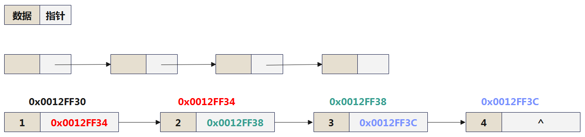

## 指针的运算

指针作为一种特殊的数据类型可以参与运算，但与其他数据类型不同的是，指针的运算都是针对内存中的地址来实现的。

### 取址运算符：&

取址运算符，使用“`&`”符号来表示。作用：`取出指定变量在内存中的地址`

语法格式如下：

```c
&变量
```

示例1：

```c
int num = 10; 
printf("num = %d\n", num); // 输出变量的值。 num = 10
printf("&num = %p\n", &num); // 输出变量的内存地址。&num = 00000050593ffbbc
```

> 说明：
>
> 1、在输出取址运算获得的地址时，需要使用“%p”作为格式输出符。
>
> 2、这里num的4个字节，每个字节都有地址，取出的是第一个字节的地址（较小的地址）。

示例2：将变量的地址赋值给指针变量

```c
int num = 10;
int *p; //p为一个整型指针变量
p = &num; 
printf("p = %p, *p = %d\n", (void*)p, *p); // 输出指针的值和指针指向的值
```

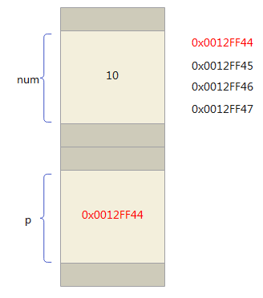

示例3：多个指针指向同一变量

```c
int d = 10;
int *e, *f;
e = &d;
f = e;
printf("e = %p, *e = %d\n", (void*)e, *e);
printf("f = %p, *f = %d\n", (void*)f, *f);
```

**指针变量的赋值**

1、指针变量中只能存放地址（指针），不要将一个整数（或任何其它非地址类型的数据）赋给一个指针变量。

2、C语言中的地址包括位置信息(内存编号，或称纯地址)和它所指向的数据的类型信息，即它是“`带类型的地址`”。所以，一个指针变量只能指向同一个类型的变量，不能抛开类型随意赋值。

- `char*` 类型的指针是为了存放 `char` 类型变量的地址。
- `short*` 类型的指针是为了存放 `short` 类型变量的地址。
- `int*` 类型的指针是为了存放 `int` 类型变量的地址。

3、在没有对指针变量赋值时，指针变量的值是不确定的，可能系统会分配一个未知的地址，此时使用此指针变量可能会导致不可预料的后果甚至是系统崩溃。为了避免这个问题，通常给指针变量赋初始值为0(或NULL)，并把值为0的指针变量称为`空指针变量`。

示例4：通过指针变量修改指向的内存中的数据

```c
int num = 10;
int *ptr = &num;
printf("num = %d\n", num);

scanf("%d", ptr); // 等价于scanf("%d", &num);

printf("num = %d\n", num);
```

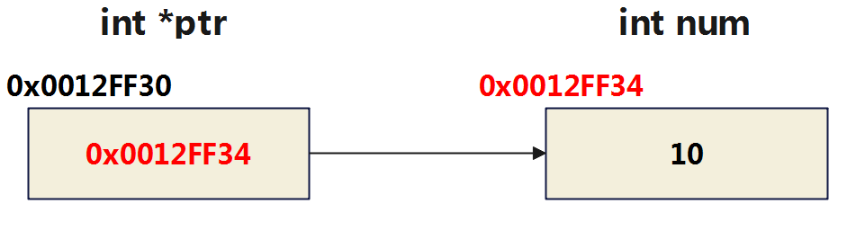

### 取值运算符：*

取值运算符使用“`*`”符号表示。其`作用与&相反`，根据一个给定的内存地址取出该地址对应变量的值。也称为`解引用符号`。其格式如下：

```c
*指针表达式
```

其中，“`*`”不同于定义指针变量的符号，这里是运算符。“指针表达式”用于得到一个内存地址，与“*”结合以获得该内存地址对应变量的值。

示例1：

```c
int a = 2024;
int *p;
p = &a;

printf("&a = %p\n", (void*)&a); // 输出地址
printf("p = %p\n", (void*)p);  // 输出地址
printf("*p = %d\n", *p); // 输出指针指向的值
```

示例2：

```c
int num = 10; //这里定义一个整型变量num
printf("num = %d\n", num); //输出变量num的值。输出：num = 10
printf("&num = %p\n", &num); //输出变量num的地址。输出：&num = 000000e6a11ffa1c

int *p = &num;
printf("%p\n",p); //输出指针地址 000000e6a11ffa1c
printf("%d\n",*p);//输出指针指向的值 10

printf("*&num = %d\n", *&num);//通过num地址读取num中的数据。输出：*&num = 10
```

`&` 运算符与 `*` 运算符互为逆运算，下面的表达式总是成立：

```c
int i = 5;
if (i == *(&i)) // 正确
```


示例3：通过指针变量修改指向内存地址位置上的值

```c
int num = 10;
int *p = &num;
*p = 20;
printf("num = %d\n",num);  //num = 20

char ch = 'w';
char* pc = &ch;
*pc = 's';
printf("ch = %c\n", ch); //ch = 's'

```

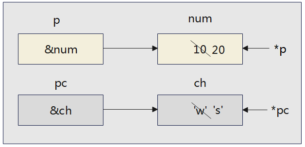

示例4：指针变量指向不同变量并进行比较

定义指针变量 p1、p2，默认各自指向整数a、b，a、b从键盘输入。设计程序，使得 p1 指向其中的较大值，p2 指向其中的较小值 。

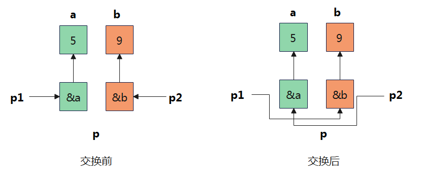

```c
int *p1, *p2, *p, a, b;
printf("请输入两个整数: ");
scanf("%d,%d", &a, &b);
p1 = &a;
p2 = &b;
if (a < b) {
    p = p1;
    p1 = p2;
    p2 = p;
}

printf("输出p1、p2: ");
printf("%d,%d\n", *p1, *p2);
```

示例5：已有代码如下：

```c
int a = 10;
int *p;
p = &a;
```

请看问题：

问题1：`&*p`的含义是什么?

- `“&”`和`“*”`两个运算符的优先级别相同，但按自右而左方向运算。因此，`&*p`与`&a`相同，即变量a的地址。
- 如果有`p1 = &*p; `它的作用是将`&a` (a的地址)赋给`p1` ，如果`p1`原来指向 b，经过重新赋值后它已不再指向b了，而指向了a。

问题2：`*&a`的含义是什么?

- 先进行`&a`运算，得a的地址，再进行`*`运算。`*&a`和`*p`的作用是一样的，它们都等价于变量a。即`*&a`与 a 等价。

### 指针的常用运算

指针本质上就是一个无符号整数，代表了内存地址。除了上面提到的取址运算外，指针还可以与整数加减、自增自减、同类指针相减运算等。但是规则并不是整数运算的规则。

#### 指针与整数值的加减运算

格式：`指针 ± 整数`

指针与整数值的加减运算，表示指针所指向的内存地址的移动（加，向后移动；减，向前移动）。指针移动的单位，与指针指向的数据类型有关。**数据类型占据多少个字节，每单位就移动多少个字节。**

通过此操作，可以快速定位你要的地址。 

```c
short *s;
s = (short *) 0x1234;
printf("%hx\n", s + 1); //0x1236   复习：%hx ：十六进制 short int 类型
printf("%hx\n", s - 1); //0x1232

int *i;
i = (int *) 0x1234;
printf("%x\n", i + 1); //0x1238    复习：%x ：十六进制整数
```

> 说明：s + 1 表示指针向内存地址的高位移动一个单位，而一个单位的 short 类型占据两个字节的宽度，所以相当于向高位移动两个字节。

再比如：变量 a、b、c、d 和 e 都是整型数据 int 类型，它们在内存中占据一块连续的存储区域。指针变量 p 指向变量 a，也就是 p 的值是 0xFF12，则：


说明：指针 p + 1 并不是地址 +1，而是指针 p 指向数组中的下一个数据。比如，int *p，p + 1 表示当前地址 +4，指向下一个整型数据。

示例1：

```c
	int arr[5] = {1, 2, 3, 4, 5};
    int *p = &arr[1];
    printf("p的地址为：%p,对应的值为%d\n", p, *p); //p1的地址为：000000df21bff6e4,对应的值为2
    printf("p+1=的地址为：%p,对应的值为%d\n", p + 1, *(p + 1)); //p1+1=的地址为：000000df21bff6e8,对应的值为3
    printf("p-1=的地址为：%p,对应的值为%d\n", p - 1, *(p - 1)); //p1-1=的地址为：000000df21bff6e0,对应的值为1

```

> 注意：只有指向连续的同类型数据区域，指针加、减整数才有实际意义。

示例2: 通过指针遍历数组

对于长度是 N 的一维数组 a，当使用指针 p 指向其首元素后，即可通过指针 p 访问数组的各个元素。


其中：

- `a[0]`用 `*p` 表示

- `a[1]`用`*(p+1)`表示

- `a[i]`用`*(p+i)`表示

遍历数组操作如下：

```c
#define LENGTH 5

int arr[LENGTH] = {10,20,30,40,50};

    //方式1：传统直接访问的方式
    for(int i = 0;i < LENGTH;i++){
        printf("%d ",arr[i]);
    }

    printf("\n");

    //方式2：使用指针访问
    int *p = &arr[0];
    for(int i = 0;i < LENGTH;i++){
        printf("%d ",*(p+i));
    }
```

#### 指针的自增、自减运算

指针类型变量也可以进行自增或自减运算，如下：

```c
p++ 、 p-- 、 ++p 、--p
```

++和--在运算符章节已经讲过，这里针对指针的增加或减少指的是内存地址的向前或向后移动。

针对于数组来说，由于数组在内存中是连续分布的。

- 当对指针进行++时，指针会按照它指向的数据类型字节数大小增加，比如 int * 指针，每 ++ 一次， 就增加4个字节。
- 当对指针进行--时，指针会按照它指向的数据类型字节数大小减少，比如 int \* 指针，每 -- 一次， 就减少4个字节。

示例1：

```c
int arr[5] = {1, 2, 3, 4, 5};
int *p1 = &arr[0];
int *p2 = &arr[3];
printf("p1的值为：%d\n", *p1);        //1
printf("++p1的值为：%d\n", *(++p1));  //2
printf("p1的值为：%d\n", *p1);        //2

printf("p1的地址为：%p\n", p1);      //00000055c0bff704
printf("p1++的地址为：%p\n", ++p1);  //00000055c0bff708


printf("p2的值为：%d\n", *p2);       //4
printf("--p2的值为：%d\n", *(--p2)); //3
printf("p2的值为：%d\n", *p2);       //3
```

示例2：请分析下面几种情况。

初始情况：

```c
int a[5] = {10,20,30,40,50};
```

情况1：

```c
int *p = a;  //p开始时指向数组a的首元素    等同于 int *p = &a[0];

p++; //使p指向下一元素a[1]
printf("%d\n",*p); //得到下一个元素a[1]的值，即20
```

情况2：

```c
int *p = a;  //p开始时指向数组a的首元素

printf("%d\n",*p++); //10   分析：由于++和*同优先级，结合方向自右而左，因此它等价于*(p++)
printf("%d\n",*p);   //20
```

拓展：

```c
*(p++); //先取*p值，然后使p自增1
*(++p); //先使p自增1，再取*p
```

拓展：如果 p 当前指向 a 数组中第 i 个元素a[i]，则：

```c
*(p--) //相当于a[i--]，先对p进行“*”运算，再使p自减
*(++p) //相当于a[++i]，先使p自加，再进行“*”运算
*(--p) //相当于a[--i]，先使p自减，再进行“*”运算
```

情况3：

```c
int *p = &a[2];  //p开始时指向数组a的第3个元素
printf("%d\n",*(p--)); //30
    
p = &a[2];
printf("%d\n",*(++p)); //40

p = &a[2];
printf("%d\n",*(--p)); //20
```

情况3：

```c
int *p = a;            //p开始时指向数组a的首元素
printf("%d\n",++(*p)); //11

/*
分析：表示p所指向的元素值加1，如果p=a, 则相当于++a[0]，若a[0]的值为10，则a[0]的值为11。
注意: 是元素a[0]的值加1，而不是指针p的值加1
*/
```

#### 同类指针相减运算

格式：`指针 - 指针`

相同类型的指针允许进行减法运算，返回它们之间的距离，即`相隔多少个数据单位（注意：非字节数）`。高位地址减去低位地址，返回的是正值；低位地址减去高位地址，返回的是负值。

返回的值属于 `ptrdiff_t` 类型，这是一个带符号的整数类型别名，具体类型根据系统不同而不同。这个类型的原型定义在头文件 stddef.h 里面。

示例1：

```c
short *ps1;
short *ps2;
ps1 = (short *) 0x1234;
ps2 = (short *) 0x1236;
ptrdiff_t dist = ps2 - ps1;
printf("%d\n", dist); // 1   相差2个字节正好存放1个 short 类型的值。

int *pi1;
int *pi2;

pi1 = (int *) 0x1234;
pi2 = (int *) 0x1244;

ptrdiff_t dist1 = pi2 - pi1;
printf("%d\n",dist1);  //4   相差16个字节正好存放4个 int 类型的值。
```

示例2：

```c
int arr[5] = {1, 2, 3, 4, 5};
int *p1 = &arr[0];
int *p2 = &arr[3];
printf("p1的地址为：%d\n", p1); //497022544
printf("p2的地址为：%d\n", p2); //497022556
printf("p2-p1=%d\n", p2 - p1); //3 等同于 (497022556 - 497022544)/4 ==> 3

```

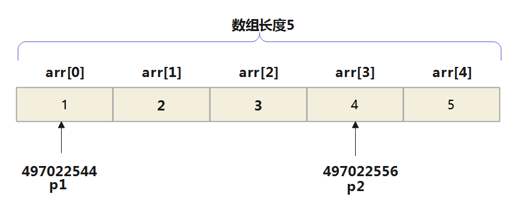

> 体会：两个指针相减，通常两个指针都是指向同一数组中的元素才有意义。结果是两个地址之差除以数组元素的长度。不相干的两个变量的地址，通常没有做减法的必要。

示例：

```c
int i = 10;
int j = 20;
int *p1 = &i;
int *p2 = &j;

ptrdiff_t dist = p1 - p2;
printf("%d\n",dist);   //通常没有计算减法的必要
```

**非法：同类指针相加运算**

两个指针进行加法是`非法的`，所得结果是没有意义的。

```c
int i = 10,j = 20;
int *p1 = &i;
int *p2 = &j;
int *p3 = p1 + p2; //非法
```

#### 指针间的比较运算

指针之间的比较运算，比如 `==`、`!=` 、`<`、`<=` 、`>`、`>=`。比较的是各自的内存地址的大小，返回值是整数 1 （true）或 0 （false）。

示例：

```c
int arr[5] = {1, 2, 3, 4, 5};
int *p1 = &arr[0];
int *p2 = &arr[3];

printf("%d\n",p1 > p2);  //0
printf("%d\n",p1 < p2);  //1
printf("%d\n",p1 == p2); //0
printf("%d\n",p1 != p2); //1
```

练习：

```c
int arr[] = {10, 20, 30};
int *ptr;
ptr = arr;  //ptr指向arr首地址(第一个元素)
if (ptr == arr[0]) { //错误,类型不一样
    printf("ok1\n");
}
if (ptr == &arr[0]) { // 可以
    printf("ok2\n"); //输出
}
if (ptr == arr) { //可以
    printf("ok3\n"); //输出
}
if (ptr >= &arr[1]) { //可以比较,但是返回false
    printf("ok4\n");//不会输出
}

if (ptr < &arr[1]) { //可以比较,返回true
    printf("ok5\n");//输出
}

```

**总结: **

**指针定义：**特殊变量，存储另一变量的内存地址，允许间接访问和操作该地址的数据。

**内存地址**：每个变量占有特定内存位置，通过地址标识。指针变量即存储这些地址。

**声明**：格式 `数据类型 *指针变量名;`。例如，`int *p;` 声明指向整型的指针 `p`。

**取址(&)和解引用(\*)运算符**：

- 取址运算符 `&` 获取变量地址。
- 解引用运算符 `*` 访问指针指向的内存位置值。

**赋值**：可将变量地址赋给指针，或指针值赋给另一指针。例如，`p = #`。

**与数组的关系**：指针可用于遍历数组元素，`int *p = arr;` 后通过 `*(p+i)` 访问第 `i` 个元素。

**指针运算**：

- **加减**：基于指向的数据类型大小进行地址移动。
- **自增自减**：`p++` 或 `p--` 移动指针一个数据单位。
- **差运算**：同类型指针相减得到相隔数据单位数。
- **比较**：使用比较运算符比较指针地址值。


## 野指针

### 什么是野指针

野指针是指向一个未定义或无效内存地址的指针。由于这些地址是不可预知的（随机性、不正确、没有明确限制），使用野指针可能导致程序崩溃或产生不可预料的结果。

### 野指针的成因

#### 指针使用前未初始化

指针变量在定义时如果未初始化，**其值是随机的**，此时操作指针就是去访问一个不确定的地址，结果是不可预知的。此时指针就是野指针。

```c
int *p;
printf("%d\n", *p); // 未初始化的指针，随机地址
```

在没有显式初始化指针变量的情况下，对其进行任何操作（包括修改指向内存的数据的值）都是错误的。

```c
int* p;                       
*p = 10;   // 未初始化的指针，随机地址
```

拓展：注意如下的赋值操作也是错误的

```c
int num = 10;
int *p;
p = num;		// 错误：应为 p = &num;
```

#### 指针越界访问 

```
int arr[10] = {0};
int *p = arr;
for (int i = 0; i <= 10; i++,p++) {
	*p = i;                   //i=10时越界
}
```

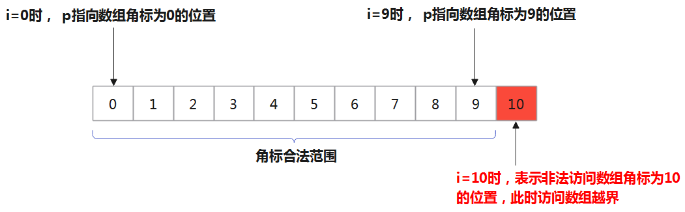

当i=10时，此时`*p`访问的内存空间不在数组有效范围内，此时`*p`就属于非法访问内存空间，p为野指针。

#### 指针指向已释放的空间

```c
int *test() {
    int a = 10;
    return &a;          //&a=0x0012ff40
}

int main() {
    int *p = test();
    printf("%d", *p);
    return 0;
}
```

调用 `test` 函数将返回值赋给 `p`，`test` 函数的返回值是局部变量 `a` 的地址。由于 `a` 只在 `test` 函数内有效，出了 `test` 函数其内存空间就被释放，也就意味着 `a的地址编号不存在`，若将其赋值给 `p`，导致 `p` 获取到的地址是`无效`的。

如果短时间内再次利用这块地址，它的值还未被改变也就是0x0012ff40还存在，p的值为0x0012ff40，*p时还是10，可以打印出。

但如果在打印之前有其他函数调用了这块地址，这块地址的名称就会发生变化，不再是 0x0012ff40，打印 `*p` 时不再为 10。

总之，此时p为野指针。

### 野指针的避免

**1、指针初始化**

定义指针的时候，如果没有确切的地址赋值，为指针变量赋一个 NULL 值是好的编程习惯。即

```c
int *p = NULL;
```

> 赋为 NULL 值的指针被称为空指针，NULL 指针是一个定义在标准库 `<stdio.h>` 中的值为零的常量 `#define NULL 0`

后面如果用到指针的话再让指针指向具有实际意义的地址，然后通过指针的取值符号 `*` 改变其指向的内容。

练习：

```c
int *p = NULL; //空指针不要与未初始化的指针混淆

int b = 8;
p = &b;   //显式赋值
*p = 100;
printf("%d\n", *p);  //100
printf("%d\b", b);   //100
```

**2、小心指针越界**

在操作指针时，确保指针不越界访问内存。

**3、避免返回局部变量的地址**

不要返回函数内局部变量的地址。

**4、指针指向空间释放，及时置NULL**

```c
int a = 10;			
int* pa = &a;
printf("%d\n", *pa);
 
pa = NULL;				//把pa指针置成NULL
 
printf("%d\n",pa);
```

**5、指针使用之前检查有效性**

```c
if (pa != NULL){
	//进行使用
}
if (pa == NULL){
	//不进行使用
}
```

> 总结:
> 野指针是指向未定义或无效内存地址的指针，使用它可能导致程序崩溃或不可预料的结果。野指针的成因主要包括：
>
> 1. **指针未初始化**：定义指针时若未进行初始化，则指针值随机，指向不确定地址，容易成为野指针。
> 2. **指针越界访问**：指针操作超出其应访问的内存范围，如数组操作越界。
> 3. **指向已释放空间的指针**：指针指向的内存空间被释放后，再访问该指针会导致野指针。
>
> 避免野指针的方法包括：
>
> 1. **指针初始化**：定义指针时，若无确切地址赋值，应初始化为`NULL`，避免成为野指针。
> 2. **避免指针越界**：确保指针操作不越界，避免非法内存访问。
> 3. **不返回局部变量地址**：避免从函数返回局部变量的地址，因为局部变量的生命周期仅在函数执行期间。
> 4. **指针释放后置为NULL**：指针指向的空间被释放后，应立即将指针置为`NULL`，避免野指针。
> 5. **检查指针有效性**：使用指针前检查其是否为`NULL`，确保其指向有效内存。
>

## 二级指针(多重指针)

指针变量存储的是另一个变量的地址。二级指针是指向指针的指针，即其值是另一个指针变量的地址。

### 二级指针的定义

一个指针 p1 记录一个变量的地址。由于指针p1也是变量，自然也有地址，那么p1变量的地址可以用另一个指针p2来记录。则p2就称为二级指针。

简单来说，二级指针即一个指针变量的值是另外一个指针变量的地址。通俗来说，二级指针就是指向指针的指针。

**格式：**

```
数据类型 **指针名;
```

### 示例1：基本使用

```c
int a = 10;
int *pa = &a;  // pa是一级指针
int **ppa = &pa; // ppa是二级指针，类型为int **

printf("a的值: %d\n", a);
printf("通过一级指针pa获取a的值: %d\n", *pa);
printf("通过二级指针ppa获取a的值: %d\n", **ppa);
//在上述代码中，ppa 是一个二级指针，它指向一级指针 pa 的地址。通过 **ppa 可以访问到 a 的值。
```

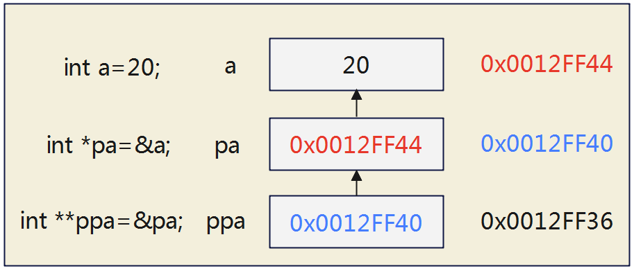

> 进而推理，会有int ***pppa = &ppa; 等情况，但这些情况一般不会遇到。

在上述代码基础上，

```c
int b = 20;
ppa = &b; //报错
```

将 `ppa`（类型为 `int **`，即二级指针）赋值为 `&b` 是错误的，因为 `&b` 是一个 `int *` 类型的指针，而不是 `int **` 类型。这会导致类型不匹配的错误。

如果您想要将 ppa 指向 b，可以找一个额外的一级指针作为中介。如下操作：

```c
int b = 20;
int *pb = &b;     // 使用一级指针来指向b
ppa = &pb;        // 将ppa指向pb的地址，ppa是二级指针
```

### 示例2：多级指针的使用

```c
int var = 3000;
int *ptr = &var;        // 一级指针指向 var
int **pptr = &ptr;      // 二级指针指向 ptr
int ***ppptr = &pptr;   // 三级指针指向 pptr

printf("var的值: %d\n", var);
printf("通过一级指针ptr获取var的值: %d\n", *ptr);         // 解引用一次
printf("通过二级指针pptr获取var的值: %d\n", **pptr);      // 解引用两次
printf("通过三级指针ppptr获取var的值: %d\n", ***ppptr);   // 解引用三次
```

在这个例子中，我们展示了多级指针的使用。`ptr` 是一级指针，`pptr` 是二级指针，`ppptr` 是三级指针。通过多次解引用，可以访问到原始变量的值。


### 示例3：使用`malloc()`函数创建二维数组

`malloc()` 函数用于动态分配堆内存，`free()` 函数用于释放堆内存。这两个函数通常都是配合一起使用的。

```c
#include <stdio.h>
#include <stdlib.h>

int main() {
    int rows, cols; // 定义二维数组的行和列
    printf("请输入行数：");
    scanf("%d", &rows);
    printf("请输入列数：");
    scanf("%d", &cols);

    // 动态分配二维数组
    int **array = (int **)malloc(rows * sizeof(int *));
    for (int i = 0; i < rows; i++) {
        array[i] = (int *)malloc(cols * sizeof(int));
    }

    // 初始化数组并打印
    for (int i = 0; i < rows; i++) {
        for (int j = 0; j < cols; j++) {
            array[i][j] = i * cols + j;
            printf("%d ", array[i][j]);
        }
        printf("\n");
    }

    // 释放内存
    for (int i = 0; i < rows; i++) {
        free(array[i]);
    }
    free(array);

    return 0;
}
```

在这个例子中，我们使用 `malloc()` 函数动态分配内存来创建一个二维数组，并使用二级指针 `int **array` 来管理这块内存。

### 总结

1. **二级指针的定义**：二级指针是指向指针的指针，其值是另一个指针变量的地址。
2. **二级指针的声明**：使用 `数据类型 **指针名` 的形式来声明二级指针。
3. **多级指针的使用**：可以通过多次解引用来访问原始变量的值。
4. **动态内存分配**：使用 `malloc()` 函数动态分配内存，使用 `free()` 函数释放内存，二级指针在动态分配二维数组时非常有用。

## 专题：指针与数组

复习：


- `*`，也称为解引用符号，用于访问指针所指向的内存地址的值，与`&`相反。
- `*`后面只能跟指针（即地址）或指针变量，而`&`后面跟的是普通变量（包括指针变量）。

### 一维数组与指针

#### 指向一维数组的指针变量

所谓`数组元素的指针就是数组元素的地址`。可以用一个指针变量指向一个数组元素。

```c
int a[10]={2,4,6,8,10,12,14,16,18,20}; 
int *p; //定义p为指向整型变量的指针变量
p = &a[0]; //把a[0]元素的地址赋给指针变量p
```

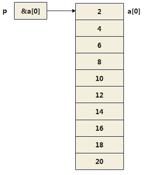

如下几个写法是等价的：

```c
int *p;
p = &a[0];  //千万不要写成*p = &a[0];，那就错了
```

```c
int *p = &a[0];
```

```c
int *p = a; // a代表数组首元素a[0]的地址，而不是整个数组
```

注意：由于数组名a保存的是**数组首元素a[0]的地址**，所以在`scanf`函数中，如果输入项是数组名，**不要再加地址符`&`**。

```c
char arr[10];
scanf("%s", arr);  // arr前不应加 &
puts(arr);
```

#### 使用指针访问数组的元素

如果指针变量p的初值为`&a[0]`，则：

- `p+i`和`a+i`是数组元素`a[i]`的地址，即它们指向a数组序号为i的元素。

- `*(p+i)`或`*(a+i)`是`p+i`或`a+i`所指向的数组元素的值，即a[i]的值。


示例1：数组元素赋值、遍历

方式1：下标法

```c
#include <stdio.h>
#define N 5

int main() {
    int a[N];
    printf("请输入%d个整数：\n", N);
    for (int i = 0; i < N; i++)
        scanf("%d", &a[i]); // 数组元素用数组名和下标表示

    for (int i = 0; i < N; i++)
        printf("%d ", a[i]);

    printf("\n");
    return 0;
}
```

方式2：

```c
#include <stdio.h>
#define N 5

int main() {
    int a[N];
    printf("请输入%d个整数：\n", N);
    for (int i = 0; i < N; i++)
        scanf("%d", &a[i]); // 数组元素用数组名和下标表示

    for (int i = 0; i < N; i++)
        printf("%d ", *(a + i));

    printf("\n");
    return 0;
}
```

方式3：使用指针变量

```c
#include <stdio.h>
#define N 5

int main() {
    int a[N];
    int *p = a;
    printf("请输入%d个整数：\n", N);
    for (int i = 0; i < N; i++)
        scanf("%d", p + i);

    for (int i = 0; i < N; i++)
        printf("%d ", *(p + i));

    printf("\n");
    return 0;
}
```

或者

```c
#include <stdio.h>
#define N 5

int main() {
    int a[N];
    int *p = a;
    printf("请输入%d个整数：\n", N);
    for (int i = 0; i < N; i++)
        scanf("%d", p + i);

    for (p = a; p < (a + N); p++)
        printf("%d ", *p);

    printf("\n");
    return 0;
}
```

> 第(1)和第(2)种方法执行效率相同。C编译系统将`a[i]`转换为`*(a+i)`处理，即先计算元素地址。因此第(1)和第(2)种方法找数组元素**费时较多**。
>
> 第(3)种方法比第(1)、第(2)种方法快，用指针变量直接指向元素，不必每次都重新计算地址，像`p++`这样的自加操作比较快。这种有规律地改变地址值(p++)能大大**提高执行效率**。但第(1)方法比较直观，适合初学者。

**思 考：**

可以通过改变指针变量p的值指向不同的元素。如果不用p变化的方法而用数组名a变化的方法（例如，用a++）行不行呢？（不行）

```c
for(p = a;a < (p + N);a++)
	printf("%d",*a);
```

因为数组名a代表数组的首地址（或数组首元素的地址），它是一个指针型常量，它的值在程序运行期间是固定不变的。所以a++是无法实现的。必须将a的地址赋值给指针变量p，然后对p进行自增。

示例2：获取数组的最大值

```c
#define N 5

int main() {
    int a[N];
    int *p;
    p = a;
    printf("请输入%d个数据：\n", N);
    for (int i = 0; i < N; i++)
        scanf("%d", p + i);
    //获取最大值
    int max = *p;
    for (int i = 1; i < N; i++)
        if (max < *(p + i))
            max = *(p + i);
    printf("Max: %d\n", max);

    return 0;
}
```

#### 指针带下标的使用

指向数组元素的指针变量也可以带下标，如`p[i]`。`p[i]`被处理成`*(p+i)`，如果p是指向一个整型数组元素a[0]，则`p[i]`代表`a[i]`。但是必须弄清楚p的当前值是什么？**如果当前p指向a[3]，则`p[2]`并不代表`a[2]`，而是`a[3+2]`，即`a[5]`**

示例：

```c
int a[5] = {10,20,30,40,50};
int *p = a;

//遍历数组元素
for(int i = 0;i < 5;i++){
    printf("%d ",p[i]);
}
printf("\n");

//注意：
p++;
printf("%d ",p[0]); //20
```

#### &数组名

示例1：

```c
//复习
int arr[5] = {0};
int *p = arr;
printf("%p\n",p);  //000000000034fa50
printf("%p\n",&p); //000000000037fbd8
```

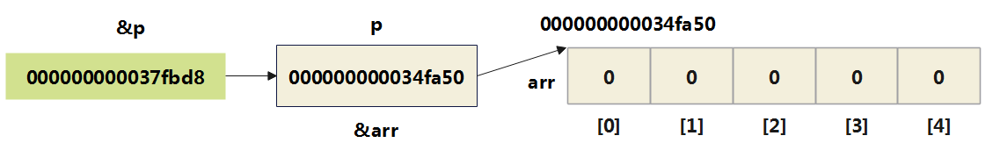

进一步思考：

```c
printf("%p\n", arr);  //000000000034fa50
printf("%p\n", &arr); //000000000034fa50
```

发现，`数组名` 和 `&数组名` 打印的地址是一样的。

示例2：

```c
int arr[5] = {0};
printf("arr = %p\n", arr);        //000000cade5ff750
printf("&arr= %p\n", &arr);       //000000cade5ff750
printf("arr+1 = %p\n", arr + 1);    //000000cade5ff754
printf("&arr+1= %p\n", &arr + 1);   //000000cade5ff764
```

`&arr` 理解为数组的地址，而不是数组首元素`a[0]`的地址。`&arr`的类型是 `int (*)[5]`，是一种数组指针类型。数组的地址+1，跳过整个数组的大小，所以 `&arr+1` 相对于 `&arr` 的差值是20（假设每个`int`占用4个字节，数组有5个元素）


### 二维数组与指针

#### 使用数组名访问

设有一个二维数组 a 定义为：

```c
int a[3][4] = {{1, 2,  3,  4},
               {5, 6,  7,  8},
               {9, 10, 11, 12}};
```

二维数组 `a` 可视为三个一维数组：`a[0]`、`a[1]`、`a[2]`；每个一维数组由 4 个元素组成。

```c
printf("%d\n",a[0][0]);  //二维数组中元素a[0][0]的值
printf("%p\n",&a[0][0]); //二维数组中元素a[0][0]的值对应的地址
printf("%p\n",a[0]);     //二维数组中a[0][0]的地址
printf("%p\n",a);        //二维数组中a[0]的地址
printf("%p\n",&a);       //二维数组a的地址
```

对应图示

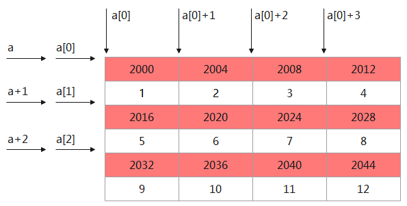

示例：

| 表示形式                         | 含义                                            | 地址        |
| -------------------------------- | ----------------------------------------------- | ----------- |
| `a`                              | 二维数组名，指向一维数组a[0]，<br>即0行起始地址 | 2000        |
| `&a[0][0],a[0],*a `              | 0行0列元素地址                                  | 2000        |
| `a[0][0],*(a[0]),**a`            | 0行0列元素`a[0][0]`的值                         | 1           |
| `&a[1],a+1`                      | 指向索引为1行的起始地址                         | 2016        |
| `&a[1][0],a[1],*(a+1)`           | 1行0列元素`a[1][0]`的地址                       | 2016        |
| `a[1][0],*(a[1]),*(*(a+1))`      | 1行0列元素`a[1][0]`的值                         | 5           |
| `&a[1][2],a[1]+2,*(a+1)+2`       | 1行2列元素`a[1][2]`的地址                       | 2024        |
| `a[1][2],*(a[1]+2),*(*(a+1)+2) ` | 1行2列元素`a[1][2]`的值                         | 是元素值，7 |

总结：

```plaintext
&a: 二维数组a的地址
a: 二维数组中a[0]的地址
a[0]: 二维数组中a[0][0]的地址

讨论：a[0][0]相关的
a[0][0]的地址：&a[0][0], a[0], *a
a[0][0]的值： a[0][0], *(a[0]), **a

讨论：a[1]相关的
a[1]的地址：&a[1], a + 1

讨论：a[1][0]相关的
a[1][0]的地址：&a[1][0], a[1], *(a+1)
a[1][0]的值：a[1][0], *(a[1]), *(*(a+1))

讨论：a[1][2]相关的
a[1][2]的地址：&a[1][2], a[1]+2, *(a+1)+2
a[1][2]的值：a[1][2], *(a[1]+2), *(*(a+1)+2)
```

> 注意：
>
> 如果 `a` 是二维数组，则 `a[i]`代表一个数组名，`a[i]`并不占内存单元，也不能存放`a`数组元素值。它只是一个地址。所以：`a`、`a+i`、`a[i]`、`*(a+i)`、`*(a+i)+j`、`a[i]+j` 都是地址。

获取数组元素值的三种表示形式：

1） `a[i][j]` 下标法

2） `*(a[i]+j)` 用一维数组名

3） `*(*(a+i)+j)` 用二维数组名

#### 使用指针变量访问

设 `p` 是指针变量，若 `p` 指向数组首元素，即 `p = a[0];`，那 `a[i][j]` 的指针如何表示？

```c
int a[3][2] = {{10, 20},
               {30, 40},
               {50, 60}};

int *p;
p = &a[0][0];
printf("%p\n", p);     //000000f2f49ff7b0
printf("%p\n", p + 1); //000000f2f49ff7b4
printf("%p\n", p + 2); //000000f2f49ff7b8

int *q;
q = a[0];
printf("%p\n", q);      //000000f2f49ff7b0
printf("%p\n", q + 1);  //000000f2f49ff7b4
printf("%p\n", q + 2);  //000000f2f49ff7b8

int *r;
r = a;  //代码片段1
printf("%p\n", r);      //000000f2f49ff7b0
printf("%p\n", r + 1);  //000000f2f49ff7b4
printf("%p\n", r + 2);  //000000f2f49ff7b8
```

进而：

- `p+j` 将指向 `a[0]` 数组中的元素 `a[0][j]`。

  对于二维数组 `a[M][N]`，由于 `a[0]`、`a[1]`、...、`a[M-1]` 等各行数组在内存中是依次连续存储，则对于 `a` 数组中的任一元素 `a[i][j]`：

  - 地址表示：`p+i*N+j`
  - 值表示：`*(p+i*N+j)`、`p[i*N+j]`

> 注意：上述代码中，代码片段1中的赋值操作会存在类型不匹配的情况，我们在5.6节中展开说明。

示例1：

```c
int b[4][3] = {{10, 20, 30},
               {40, 50, 60},
               {70, 80, 90},
               {100, 110, 120}};

int *p = b[0];
```

则：元素 `b[1][2]`对应的地址/指针、元素值为：

```c
printf("b[1][2]对应的地址/指针为：%p\n",p+1*3+2);
printf("b[1][2]对应的值为：%d\n",*(p+1*3+2));
printf("b[1][2]对应的值为：%d\n",p[1*3+2]);
```

示例2：用指针访问二维数组，求二维数组元素的最大值。

```c
#define ROWS 3
#define COLS 4

int main() {
    int a[ROWS][COLS] = {
        {10, 20, 30, 40},
        {50, 60, 70, 80},
        {120, 110, 100, 90}
    };

    // 方式1：使用下标法
    int max = a[0][0];
    for (int i = 0; i < ROWS; i++) {
        for (int j = 0; j < COLS; j++) {
            if (max < a[i][j]) {
                max = a[i][j];
            }
        }
    }
    printf("Max (方式1) = %d\n", max);

    // 方式2：使用指针法
    int *p = &a[0][0];
    max = *p;
    for (int i = 0; i < ROWS * COLS; i++) {
        if (max < *(p + i)) {
            max = *(p + i);
        }
    }
    printf("Max (方式2) = %d\n", max);

    // 方式3：使用指针遍历
    int *q, max1;
    for (q = &a[0][0], max1 = *q; q < &a[0][0] + ROWS * COLS; q++) {
        if (max1 < *q) {
            max1 = *q;
        }
    }
    printf("Max (方式3) = %d\n", max1);
```

### 指针数组

#### 数组指针 vs 指针数组

**数组指针：**

当指针变量存放一个数组的首地址时，此指针变量称为指向数组的指针变量，简称为`数组指针`。

数组指针是指针，而不是数组。

- 整型指针：`int *pint`，能够指向整型数据的指针。
- 浮点型指针：`float *pf`，能够指向浮点型数据的指针。
- 数组指针：能够指向数组的指针。

**指针数组：**

数组是用来存放一系列相同类型的数据，当然数组也可以用来存放指针，这种用来存放指针的数组被称为`指针数组`，它要求存放在数组中指针的数据类型必须一致。

指针数组是数组，而不是指针。它是存放指针的数组

#### 指针数组的使用

格式：

```c
数据类型 *指针数组名[大小];
```

示例1：

```c
int *arr[5];
```

arr是一个数组，有5个元素，每个元素是一个整型指针，需要使用下标来区分。

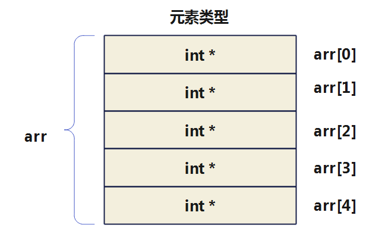

示例2：

```c
int a = 1, b = 2, c = 3, d = 4, e = 5;
int *arr[] = {&a, &b, &c, &d, &e}; // 定义一个int类型的指针数组

for (int i = 0; i < 5; i++) {
    printf("%d ", *arr[i]);
}
```

示例3：

```c
int line1[] = {1, 2, 3, 4};        // 声明数组，矩阵的第一行
int line2[] = {5, 6, 7, 8};        // 声明数组，矩阵的第二行
int line3[] = {9, 10, 11, 12};     // 声明数组，矩阵的第三行
int *p_line[3];                    // 声明整型指针数组
p_line[0] = line1;                 // 初始化指针数组元素
p_line[1] = line2;
p_line[2] = line3;

printf("矩阵:\n");
for (int i = 0; i < 3; i++) {      // 对指针数组元素循环
    for (int j = 0; j < 4; j++) {  // 对矩阵每一列循环
        printf("%d\t", p_line[i][j]); // 或改为printf("%d\t", *(p_line[i] + j));
    }
    printf("\n");
}
```

### 字符数组 vs 字符指针变量

一个字符串，可以使用`一维字符数组`表示，也可以使用`字符指针`来表示。

- 字符数组由若干个元素组成，每个元素存放一个字符。
- 字符指针变量中存放的是地址（字符串/字符数组的首地址），而不是将字符串直接存放到字符指针变量中。

示例1：

```c
char str[] = "hello tom";  //使用字符数组

char * pStr = "hello tom";  //使用字符指针
```

图示：

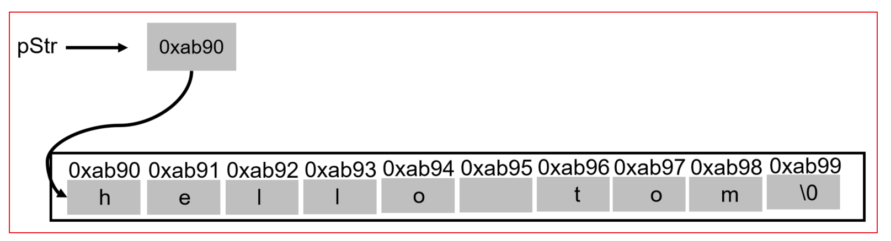

**两种方式的对比：**

对已声明好的字符数组，只能一一对各个元素赋值，不能用以下错误方法对字符数组赋值

```c
char str[14];

str[0] = 'i'; //正确

str = "hello Tom"; //错误
```

对字符指针变量，采用如下方式赋值是可以的。

```c
char * pStr = "hel";

pStr = "hello tom"; //正确
```

图示：

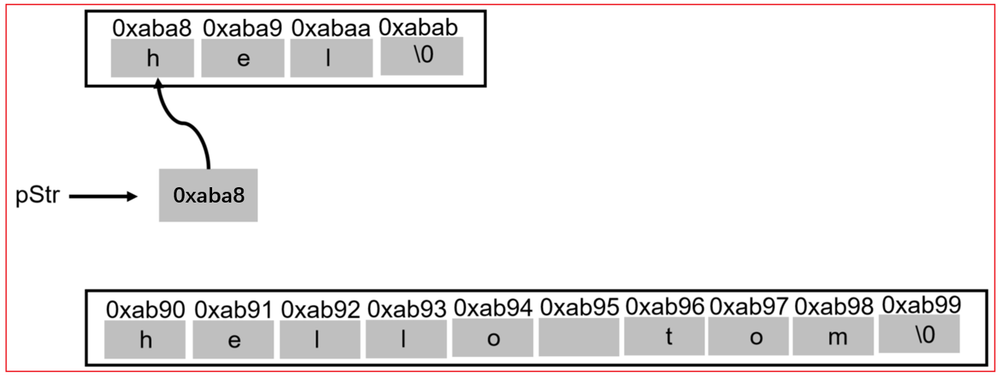


> 一个字符数组，因为它有确定的内存地址，所以字符数组名是一个`常量`。而定义一个字符指针变量时，它在指向某个确定的字符串数据的情况下，也可以多次`重新赋值`。

示例2：体会字符串字面量的不可变性

情况1：针对于整型数组、整型指针变量

```c
int arr[10] = {1, 2, 3, 4, 5, 6, 7, 8, 9, 10};
int *p = arr;

printf("%d\n", p[1]); // 2

p[1] = 50;
printf("%d\n", p[1]); // 50
printf("%d\n", arr[1]);  // 50

int num = 30;
p = &num;
printf("%d\n", *p);    // 30
printf("%d\n", p[0]);  // 30
```

情况2：针对于字符数组、字符指针变量

```c
char arr[] = "hello";

arr[1] = "m";    	//运行时错误 
printf("%s\n",arr);
```

因为字符串字面量存储在只读内存区域，是不可变的，不能修改其值。

拓展：

```c
char *pStr = "hello";
pStr = "hello tom"; //正确

pStr[1] = 'm';      //运行时错误
printf("%s\n",pStr);
```

### 字符串数组的表示

字符串可以使用一维字符数组或字符指针变量等两种方式表示，那么字符串数组如何表示呢？

如果一个数组的每个成员都是一个字符串，则构成了字符串数组。字符串数组有两种表示方式：`① 二维字符数组` ；`②字符指针数组`。

示例1：

方式1：使用二维字符数组

```c
char fruit[][7]={"Apple","Orange","Grape","Pear","Peach"}; 
```

```c
char weekdays[7][10] = {   //行数7也可以省略
	"Monday",
	"Tuesday",
	"Wednesday",
	"Thursday",
	"Friday",
	"Saturday",
	"Sunday"
};
```

字符串数组一共包含7个字符串，所以第一维的长度是7。其中，最长的字符串的长度是10（含结尾的终止符 `\0`），所以第二维的长度统一设为10。

**思考：**数组的第二维长度统一定为10，有点浪费空间，因为大多数成员的长度都小于10。解决方法是把数组的第二维从字符数组改成字符指针。

方式2：使用字符指针数组

```c
char* weekdays[7] = {  //7也可以省略
  "Monday",
  "Tuesday",
  "Wednesday",
  "Thursday",
  "Friday",
  "Saturday",
  "Sunday"
};
```

上面的字符串数组其实是一个一维数组，成员是7个字符指针，每个指针指向一个字符串（字符数组）。

类似地，可以定义表示颜色的指针数组 `colors`，存储“red”、“yellow”、“blue”、“white”、“black” 5种颜色。

```c
char *colors[5] = {"red","yellow","blue","white","black"};
```

**遍历字符指针数组：**

```c
for (int i = 0; i < 7; i++) {
	printf("%s\n", weekdays[i]);
}
```

示例2：

请编写程序，定义一个字符指针数组，用来存储四大名著的书名， 并通过遍历该指针数组，显示字符串信息 ， (即：定义一个指针数组，该数组的每个元素，指向的是一个字符串)

方式1：二维字符数组

```c
char books[4][13] = {"三国演义", "西游记", "红楼梦", "水浒传"};
int len = 4;
for (int i = 0; i < len; i++) {
    printf("books[%d] : %s\n", i, books[i]);
}
```

方式2：字符指针数组

```c
int main() {
    // 定义一个指针数组，该数组的每个元素指向一个字符串
    char *books[] = {
        "三国演义",
        "西游记",
        "红楼梦",
        "水浒传",
    };

    // 遍历
    int len = 4;
    for (int i = 0; i < len; i++) {
        printf("books[%d] : %s\n", i, books[i]);
    }

    return 0;
}
```


### 拓展：指向固定长度数组的指针变量

定义一个整型指针变量指向一维数组，一维数组的每个元素包含 m 个元素。

定义格式：

```
(*标识符)[一维数组元素个数];
```

例如：定义一个指针变量 p，它指向包含有 4 个元素的一维数组。

```
int (*p)[4];
```

> 说明：p先和*结合，说明p是一个指针变量，指向一个大小为4的整型数组。
>
> 注意：此时定义的是一个指针变量，并非是一个指针数组。(*p 必须放在括弧内，否则就变成了定义指针数组。)

由于 p 是指向有 4 个整型元素的一维数组的指针变量，因此，p+1 是将地址值加上 4*4，即指向下一个一维数组。

示例：

```c
int a[3][4] = {{1, 2,  3,  4},
               {5, 6,  7,  8},
               {9, 10, 11, 12}};
int (*q)[4];
q = a;
```

则：

`q` 为二维数组第 0 行首地址，与 `a` 相同；

`q+1` 为二维数组第 1 行首地址，与 `a+1`相同；

`q+2` 为二维数组第 2 行首地址，与 `a+2`相同；

`*(q+i)`为二维数组第 i 行第 0 列元素的地址，与`*(a+i)`相同；

`*(q+i)+j `为二维数组第 i 行第 j 列元素的地址，与`*(a+i)+j` 相同；

`*(*(q+i)+j) `为二维数组第 i 行第 j 列元素值，与`*(*(a+i)+j)`相同，即 `a[i][j]`。

示例：

```c
int main() {
    int arr[3][4] = {{1, 2,  3,  4},
                     {5, 6,  7,  8},
                     {9, 10, 11, 12}};
    int (*q)[4];
    q = arr;

    printf("arr[0]的地址为：%p\n", arr);            //0000006460dffb40
    printf("arr[0]的地址为：%p\n", q);              //0000006460dffb40
    printf("arr[0][1]的地址为：%p\n", *arr + 1);    //0000006460dffb44
    printf("arr[0][1]的地址为：%p\n", *q + 1);      //0000006460dffb44
    printf("arr[0][1]的地址为：%p\n", arr[0] + 1);  //0000006460dffb44
    printf("arr[0][1]的地址为：%p\n", q[0] + 1);    //0000006460dffb44

    printf("arr[1]的地址为：%p\n", arr + 1);       //0000006460dffb50
    printf("arr[1]的地址为：%p\n", q + 1);         //0000006460dffb50

    printf("arr[1][0]的值为：%d\n", *(*(arr + 1))); //5
    printf("arr[1][0]的值为：%d\n", *(*(q + 1)));   //5
    printf("arr[1][1]的值为：%d ", *(*(q + 1) + 1));//6

    //遍历arr[0]中的几个元素
    for (int i = 0; i < 4; i++) {
        printf("%d ", *(*q + i)); //输出1 2 3 4
    }
    printf("\n");

    return 0;
}
```
